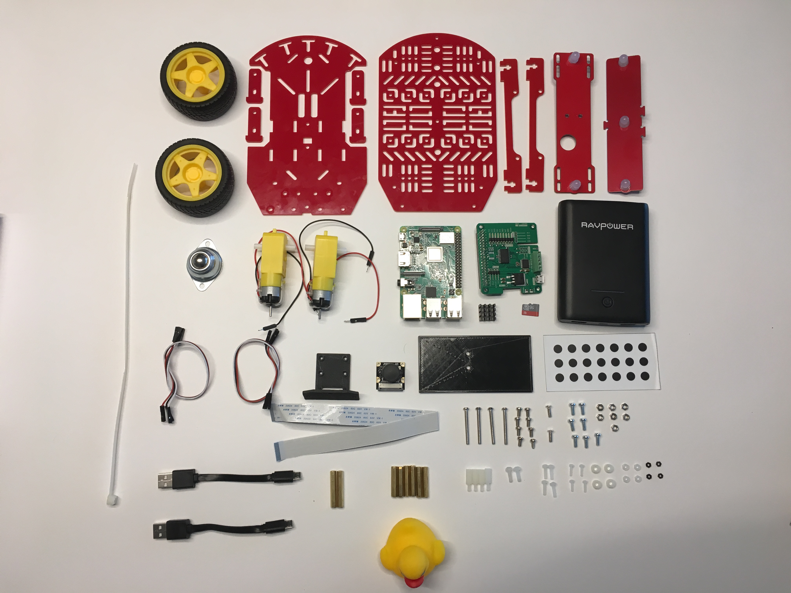

# Assembling the Duckiebot {#assembling-duckiebot-db18 status=ready}

Assigned: Gianmarco Bernasconi, Jacopo Tani

This page is for the `DB18` configuration used in classes in 2018. For last year's instructions see [here](https://docs.duckietown.org/DT17/).

Requires: Duckiebot `DB18` parts. The acquisition process is explained in .

Requires: An SD card with the Duckiebot image already on it. This procedure is explained [here](#setup-duckiebot).

Requires: Time: about 1-1.5 hours (45 minutes for an experienced Duckiebot builder).

Results: An assembled Duckiebot in configuration `DB18`.

Note: The [FAQ](#op-assembly-db18-faq) section at the bottom of this page may already answer some of you comments, questions or doubts.

There are 16 parts in this procedure. Most parts build upon previous steps, so make
sure to follow them in the following order:

- [Part 1: What is in the box?](#bom-db18)
- [Part 2: Motors](#howto-mount-motors-db18)
- [Part 3: Omni-directional wheel](#howto-mount-omniwheel-db18)
- [Part 4: Assemble Onmi-directional wheel and bottom chassis](#howto-assemble-chassis-bottom)
- [Part 5: Spacers to bottom plate](#howto-mount-spacers)
- [Part 6: Wheels](#howto-mount-wheels-db18)
- [Part 7: Preparing the Raspberry Pi](#howto-mount-rpi)
- [Part 8: Raspberry Pi and Hut](#howto-prepare-rpi-hut-assemble)
- [Part 9: Camera mount](#howto-mount-cameramount)
- [Part 10: Raspberry Pi and top plate](#howto-assemble-rpi-top)
- [Part 11: Camera](#howto-mount-camera)
- [Part 12: Chassis assembly](#howto-assemble-chassis)
- [Part 13: Circlegrid holder](#howto-mount-circlegrid-holder)
- [Part 14: Front bumper assembly](#howto-mount-front-bumper)
- [Part 15: Back bumper assembly](#howto-mount-back-bumper)
- [Part 16: Battery and Duckie](#howto-mount-battery-duckie)

## What is in the box {#bom-db18}

All the pieces in your Duckiebox are shown in . Note that you might have a different battery than in the picture, or different USB to micro USB cables, but the instructions can be followed anyway.

     

If you have got extra pieces, such as an extra heat sink or screws and nuts, just keep them apart, they could turn out to be useful in the future!

### Preliminary Steps

### Step A

Unbox all of your components, and put aside anything that is not shown in . You might have some redundant components like a black battery holder and motor encoders, in addition to spares.

### Step B

Take the rear bumper bracers and the back bumper. The back bumper will be mounted in the last steps as a press fit to the rear bumper bracers. Try to fit the bracers into the holes of the back bumper.

Some bumper bracers have a plastic protective film which is a residue of the manufacturing process. If you struggle in the press fitting, peel off the plastic cover from *one* side of the bracer. If this does not help, peel off the plastic cover from both sides.

### Step C

Peel the plastic cover from all the chassis parts (except the bumper bracers) on both sides.

### Step D

Note that two amongst all of your metal screws are special. They are "countersunk" screws. Keep these aside. They will be needed in [Part 15: Back bumper assembly](#howto-mount-back-bumper).

     

## Motors {#howto-mount-motors-db18}

From the Duckiebox package take the following components:

- Chassis-bottom (1x)
- DC Motors (2x)
- Motor holders (4x)
- M3x30 screw (4x)
- M3 nuts (4x)

 shows the components needed to complete this part of the tutorial.

     

### Step 1

Pass two of the motor holders through the openings in the bottom plate of the chassis as shown
in . If you have troubles fitting the holders, it is probably because you have not removed the protective plastic film.

     

### Step 2

Put one motor between the holders as shown in .

  

Note: Orient the motors so that their wires are inwards (i.e., towards the center of the plate).

Note: Use your screwdriver.

### Step 3

Use *2* M3x30 screws and *2* M3 nuts to secure the motor to the motor holders. Pass the screws through the holes from the outside inwards, then tighten the screws
to secure the holders to the bottom plate of the chassis as shown in .

   

Note: tighten the motors firmly, as a wobbly motor might cause troubles later on.

### Step 4

Repeat for the opposite side and check that the outcome is the same as in .

   

### Step 5

Tilt your bottom plate and pass the cables of the motors through the central hole. Keep the cables coming from each motor separated ().

   

## Omni-directional wheel {#howto-mount-omniwheel-db18}

The Duckiebot is driven by controlling the wheels attached to the DC motors.
Still, it requires a _passive_ support on the back. In this configuration an omni-directional wheel is
attached to the bottom plate of the chassis to provide such support.

From the Duckiebox package take the following components:

- Steel omni-directional wheel (1x)
- M3x25 metal spacers (2x)
- M3x10 (or M3x8) screws (2x)

 shows the components needed to complete this part of the tutorial.

     

### Step 1

Secure the M3x25 spacers to the omni-directional wheel using *2* M3 screws (M6 to M10 will work, choose the shortest you have in your pack) as shown in .

     

## Assemble omni-directional wheel and bottom chassis {#howto-assemble-chassis-bottom}

From the previously prepared pieces take the following components:

- Assembled bottom chassis (1x)
- Assembled omni-directional wheel (1x)

From the Duckiebot kit take the following components:

- M3x10 screws (4x)
 shows the components needed to complete this part of the tutorial.

     

### Step 1
Pass the screws through the designated holes from the top, as shown in 

     

### Step 2

In the bottom part, secure the omni-directional wheel using the screws.

### Check the outcome

 shows how the omni-directional wheel should be attached to the plate.

   

## Spacers {#howto-mount-spacers}

From the previously prepared pieces take the following components:

- Assembled bottom chassis

From the Duckiebot kit take the following components:

- M3x6 screws (2x)
- M3x10 screws (2x)
- M3x25 metal spacers (2x)
- M3x30 metal spacers (2x)
- 1x Rear bumper bracer

 shows the components needed to complete this part of the tutorial.

     

### Step 1

Insert two M3x8 screws in the designated holes and place the rear bumper on them, they should align as in . A litte forcing might be necessary.

     

### Step 2

Fasten the rear bumper using the M3x25 spacers (short ones), as in .

     

### Step 3

Insert screws and M3x30 (long ones) spacers on the fron of the Duckiebot, in the position indicated in .

     

## Wheels {#howto-mount-wheels-db18}

From the previously prepared pieces take the following components:

- Assembled bottom chassis

From the Duckiebot kit take the following components:

- Wheels (2x)

 shows the components needed to complete this part of the tutorial.

     

### Step 1

Insert one wheel on each motor, as in . Mind that there is a particular orientation at which the wheel will fit. Don't force them too much!

     

### Check the outcome

 shows how the assembly should look like after mounting the wheels.

   

## Preparing the Raspberry Pi {#howto-mount-rpi}

From the Duckiebot kit take the following components:

- Raspberry Pi 3B+ (1x)
- Heat sink (1x)
- Camera cable (1x)
- Micro SD card (1x)

Note: You might have two heat sinks, make sure you use the one in the picture (should be the bigger one).

 shows the components needed to complete this part of the tutorial.

     

### Step 1

Peel the cover from the bottom of the heat sink and place it on the Raspberry Pi microchip, as shown in 

     

### Step 2

Locate the camera cable plug (see  for reference) in the Raspberry Pi and lift the black "wings" to open it.

     

### Step 3

Make sure that the connectors of the camera cable match the ones in the Raspberry Pi (), then plug in the cable and push down the black wings to fasten the connection, making sure it "clicks".

Note: Please be aware that different camera
cables have the text on different sides and with different orientation, **do not** use it as a landmark.

     

### Step 4

Find the SD card holder on the Raspberry Pi (on the bottom of it). Then insert the micro SD card as in . Note that SD cards might vary in appearance, the figure is just for reference.

     

### Check the outcome

 shows how the Raspberry Pi should look like now.

   

## Raspberry Pi and Hut {#howto-prepare-rpi-hut-assemble}

From the previously prepared pieces take the following components:

- Assembled Raspberry Pi

From the Duckiebot kit take the following components:

- Duckiebot Hut (1x)
- M2.5x12 nylon spacers (4x)
- M2.5 nylon nuts (4x)
- USB to micro USB cables (2x)
- Set of three female to female(F/F) jumper wires (1x)

 shows the components needed to complete this part of the tutorial.

Note: It is cleaner if you do not separate each cable, but leave them in two sets of three.

     

### Step 1

Place the spacers on the bottom part of the Duckiebot hut, as in 

     

### Step 2

From the top of the Duckiebot Hut, secure using the M2.5 nylon nuts.

### Step 3

Place the Raspberry Pi as in , passing the camera cable through the slit in the Duckiebot Hut. Then plug in the Duckiebot Hut, by making sure that the Raspberry Pi pins fit into the Hut connector. 

     

### Step 4

Take one of the two sets of F/F jumper wires, and attach it to the Duckietown Hut as shown in . It is important to use the pins named: "5Vusb, ADR LED and GND", do *not* use the pin labelled "5Vraspi". Take note of which color have you connected to each pin.

     

### Step 5

Finally, attach the two USB cable to the power plugs, as in . Note that the color of the USB cables might vary, so don't worry if yours are not exactly as those shown in the picture below. The two USB cables could also be uncomfortably short. If your powerbank/battery comes with longer cables you might want to use them instead.

     

### Check the outcome

 shows how the Raspberry Pi 3 should look like at this point.

   

## Camera mount {#howto-mount-cameramount}

From the Duckiebox package take the following components:

- Top plate (1x)
- Camera mount (1x)
- M3x10 screws (3x)
- M3 nuts (3x)

 shows the components needed to complete this part of the tutorial.

     

### Step 1

Place the camera mount over the top place as in 

     

### Step 2

Insert the M3x10 screws from the opposite side of the camera mount (see )

     

### Step 3

Fasten using M3 nuts ()).

     

## Raspberry Pi and top plate {#howto-assemble-rpi-top}

From the previously prepared pieces take the following components:

- Assembled chassis top plate
- Assembled Raspberry Pi

From the Duckiebot kit take the following components:

- M2.5x10 Nylon screws (4x)
- M2.5x4 Nylon spacers (4x)

Note: By this moment you probably have both M2.5 and M3 Nylon screws. Make sure you use the M2.5 ones. Do not force the M3 screws.

 shows the components needed to complete this part of the tutorial.

     

### Step 1

Place the M2.5 spacers on the bottom side of the Raspberry Pi, as in .

     

### Step 2

Place the Raspberry Pi under the top plate, positioned according to . Fasten it using the M2.5x10 nylon screws.

     

## Camera {#howto-mount-camera}

From the previously prepared pieces take the following components:

- Top chassis assembly

From the Duckiebot kit take the following components:

- Camera (1x)
- M2x10 screws (4x)
- M2x10 nuts (nylon or metal) (4x)

 shows the components needed to complete this part of the tutorial.

     

### Step 1

Pass the camera cable through the top plate as in the picture, pay attention to the connector orientation, it must be the same as in .

     

### Step 2

Pass the camera cable through the camera mount ().

     

### Step 3

Pull the black wings of the camera port on the camera and plug in the camera cable. Pay attention that the pins on the camera cable match the pins on the camera. Close the connector by pushing the black wings making sure it “clicks”.
().

     

Note: Please be aware that different camera
cables have the text on different sides and with different orientation, **do not** use it as a landmark.

### Step 4

Place the camera on the camera mount, and insert the M2x10 screws from the front to the back, as in .

     

### Step 5

Secure the camera from the back using the M2 nuts. ().

     

## Chassis assembly {#howto-assemble-chassis}

From the previously prepared pieces take the following components:

- Assembled top chassis (1x)
- Assembled bottom chassis (1x)

From the Duckiebot kit take the following components:

- M3x10 screws (2x)
- Back bumper bracer (1x)

 shows the components needed to complete this part of the tutorial.

     

### Step 1

Place the top chassis assembly over the bottom chassis assembly as in .

     

### Step 2

Note: The following is a tricky step. We suggest to align your chackras and read the procedure through before starting.

For each motor, the cable that is soldered closer to the floor (bottom), goes on the *external* connection. The cable soldered on the motor on the plate side goes on the *internal* connection.

Insert the *right*-motor cable on the *right* side of the Hut connector ( perspective), and the *left*-motor cable on the *left* side of the Hut connector.

     

For reference, look at the example in , where the *left* motor (driving perspective) has the *red* wire soldered on the bottom, so it goes on the *external left* connector. Similarly, the *right* motor (driving perspective) has the *black* wire soldered on the bottom, so it goes on the *external right* connector.

     

You might find it easier to temporarily remove the USB cables while executing this passage. Make sure that you plug them back in before moving to the next one though.

### Step 3

Now flip the chassis top plate assembly, it should look like in .

     

### Step 4

Place the second rear bumper bracer on top of the chassis spacers in the back of the chassis, again the holes should align (). If you experience a slight misalignment, carefully pass an M3 screw through the top plate and the top bumper bracer first, then move the standoff until you can plug the screw in.

     

### Step 5

Fasten the top plate using the M3x10 screws, as in(.

     

### Step 6

You can use a zip tie to help with cable management (). Tip: you can use one zipties to keep the camera cable down and the USB cables below from touching the wheels.

     

## Circle grid holder {#howto-mount-circlegrid-holder}

From the Duckiebot kit take the following components:

- Back bumper (1x)
- M3x10 nylon screws (2x)
- M3x10 countersunk screws (2x)
- M3x25 spacers (2x)
- Back plate (1x)
- Circle pattern sticker (1x)

 shows the components needed to complete this upgrade.

     

Note: You could have a back plate of a different color with respect to the picture, e.g., black or white. THey are all functionally equivalent.

### Step 1

Mount the spacers using the nylon screws, as in .

     

Note: pay attention that the spacers should be in the same direction as the LEDs.

### Step 2

Take the back plate and place the countersunk screws on the side where the holes are tapered, as shown in .

     

### Step 3

Fasten the back plate to the back bumper standoffs, like shown in the picture. The back plate is not symmetric, place it such that it is centered with respect to the back bumper. Then apply the circle pattern sticker to the back plate ().

     

## Front bumper assembly {#howto-mount-front-bumper}

From the previously prepared pieces take the following components:

- Assembled chassis (1x)

From the Duckiebot kit take the following components:

- Front bumper (1x)
- Set of three female to female jumper wires (1x)
- M3x6 Screws (2x)

 shows the components needed to complete this upgrade.

Note: It is cleaner if you do not separate each cable, but leave them in two sets of three.

     

### Step 1
Place the front bumper in front of the chassis. Then locate the pins on the front bumper, you should have taken note of the connection you have done on the Duckietown Hut ().

Note: Pay attention to place the front bumper oriented as in the picture.

     

### Step 2

Pass the electric F/F cables through the top chassis for cable management purposes. Try avoid any cable from touching the wheels ().

     

Note: The ziptie can be in a different position than shown in the picture.

### Step 3

Now we need to connect the two set of wires to the front bumper.
The set of cables coming from the Raspberry Pi must be connected on the right ( perspective, namely the green blue and yellow wires in the picture), while the connector on the left (red white and black wires in the picture) will go to the back bumper. Again take note of which color you used for which pin in the left connector.

     

### Step 5

Place the cabled front bumper in front of the chassis, with your fingers slightly lift the top plate and insert the front bumper. It is a form fit, the connector on the lower part must go in the circular hole (see ), while the two top connectors will lock in just behind the camera mount (refer to ). You might need to apply some pressure once found the correct alignment for the components to "lock in".

     

     

#### Part 6

Insert and fasten the screws trough the top plate in the front chassis spacers.

## Back bumper assembly {#howto-mount-back-bumper}

From the previously prepared assemblies, and from the Duckiebox, take the following components:

- Assembled chassis (1x)
- Back bumper assembly (1x)
- (Optional) M3 screws (2x) and nuts.

 shows the components needed to complete this upgrade.

     

### Step 1

Place the back bumper as shown in , then connect the wires to the back bumper according to the connection done in the front bumper.

     

### Step 2

The back bumper is press fit to the bumper bracers, place it as in . You will have to apply little pressure, and it should fit tightly.

     

If you cannot get the bumper to fit, check if the bumper bracer has plastic protective films on both sides. In case, remove one - try again - and in case remove the other one too.

If you experience a loose fit instead, you can use two M3 screws and nuts to secure the back bumper.

<figure class="flow-subfigures">
    <figcaption>(Optional) How to secure the back bumper in case of loose fit.</figcaption>
    <figure>
        
    </figure>
    <figure>
        
    </figure>
</figure>

### Check the outcome

 shows how the current assembly should look like at this point.

   

## Battery and Duckie {#howto-mount-battery-duckie}

From the previously prepared pieces take the following components:

- Assembled chassis (1x)

From the Duckiebot kit take the following components:

- Battery (1x)
- Zip tie (1x)
- Duckie (N+1x)

 shows the components needed to complete this tutorial.

     

### Step 1

Place the battery and fix it using a zip tie, then connect the USB cables, as in .

Note: **Do not** unplug/replug the bumper wires when the power is on. You could break the bumpers!

     

### Step 2

Place the Duckie on top of your brand new Duckiebot.

Note: Be careful not to hurt the Duckie.

### Check the outcome

 and  show how the final assembly should look like. Congratulations!

   

   

Note: as a final check, verify that no cable is touching the wheels. You can use the provided zip ties to ensure that cables stay out of the way.

## FAQ {#op-assembly-db18-faq}

Q: I found it hard to mount the omni-directional wheel / the back bumper / the Raspberry Pi because the holes weren't lining up.

A: Sometimes in life you have to push a little to make things happen. (But don't push too much or things will break!)

Q: My battery is different from the one shown in the pictures! Did I get the wrong box?

A: If there is a duckie in or on your box, you most probably got the right one. We support different battery models. All supported models are functionally equivalent, although the form factor varies.
