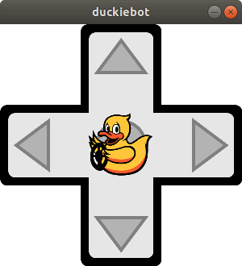

# Making your Duckiebot move {#rc-control status=ready}

This page is for Duckiebots in `DB18` configuration and above (including Jetson Nano configurations).

Requires: A Duckiebot in `DB18` or above configuration.

Requires: Laptop configured according to .

Requires: You have configured the Duckiebot as documented in .

Results: You can make your Duckiebot move.

<!--Requires: You have created a Github account and configured public keys,
both for the laptop and for the Duckiebot. The procedure is documented in .-->

## Option 0 - With a joystick

Assuming that your Duckiebot is [properly initialized](#setup-duckiebot), if you have a gamepad then plug the usb dongle into the raspberry pi of your duckiebot and you should be able to use it right away

## Option 1 - With the Duckietown Shell {#make-it-move_shell status=ready}

If you would like to move your robot using your laptop, you can run:

    $ dts duckiebot keyboard_control ![DUCKIEBOT_NAME]

which, after startup should open the interface window that looks like:

Warning: Note that in here you input Duckiebot hostname, do not include `.local` part.

<figure>
    <figcaption>The keyboard control graphical user interface</figcaption>
    
</figure>

The following keys control the Duckiebot:

<col2 figure-id="tab:virtual_keyboard" figure-caption="Keyboard joystick functions" class="labels-row1">
    Keys
    Function
    ARROW_KEYS
    Steer your Duckiebot
    q
    Quit
    a
    Turn on Lane Following
    s
    Stop Lane Following
    i
    Toggle Anti-instagram
</col2>

Warning: This does not currently work on Mac OSX.

Symptom: You receive an error about `X Error of failed request:  GLXBadContext ...`

Resolution: Debugging NVIDIA drivers can be tricky. One thing that has worked is to install `libnvidia-gl-430:i386` on your laptop (with `sudo apt`) and then restart your laptop and retry. The other option is to forego this GUI and try the no-window way or the dashboard (see below).

### The no-window way with duckietown shell (For Mac Users)

There is some weird reason that messages published on Mac inside the container don't make it all the way to the robot.

For those that don't want or can't do the above where a window pops up, do the following (which will run directly on the robot):

    laptop $ dts duckiebot keyboard_control ![hostname] --cli

## Option 2: Using the dashboard {#setup-ros-websocket-image status=draft}

If you followed the instructions in , you
should have access to the Duckiebot dashboard.

You can open the browser and visit the page `http://![hostname].local/mission-control`.

This is the Mission Control page.
It is the page that lets you monitor and control your Duckiebot.
The top of the page should be similar to the following image,

  

The first thing to check to make sure that everything we have done so far
is correct, is the status of the **Bridge**, in the top-right corner of the page.
The label should show the status "**Bridge: Connected**" (as shown in the image above).
If the indicator reads "**Bridge: Closed**", it means that something went wrong
while launching the ROS websocket node above. In that case, start again from
the beginning of this section.

Note: Don't worry if one of the blocks is called "Camera" but you
don't see an image. We will get to that later.

This page will show you lateral and angular speed of your robot, and
a plot of left and right motor speed. Toggle the **Take over** switch
in the top-right corner of the page to gain control of your robot.
You will see that the background of the page will highlight and the
central plot will start moving.

You can now use the arrows on your keyboard to drive your Duckiebot.

**Did you know?**
The page contains 4 blocks by default.
Feel free to drag them around and rearrange them as you please.
You can also use the menu button of each block to resize them.

## Troubleshooting

Symptom: Duckiebot goes backwards, even though I command it to go forward.

Resolution: Revert the polarities (plus and minus cables) that go to the motor driver for both motors.

Symptom: I can `ssh` into my Duckiebot and run the joystick demo but the joystick does not move the wheels.

Resolution: Check that the red indicator on the joystick stopped blinking.

    

        

            
        

    

    

        

            
        

    

    

Symptom: The joystick is connected (as shown in ) but
the Duckiebot still does not move.

Resolution: Make sure that the controller is connected to the Duckiebot and that the OS receives the data from it. Run

    duckiebot $ jstest /dev/input/js0

If you receive the error

    jstest: No such file or directory

it means that the USB receiver is not connected to the Raspberry Pi or is broken.

If the command above shows something like the following

    Driver version is 2.1.0.
    Joystick (ShanWan PC/PS3/Android) has 8 axes (X, Y, Z, Rz, Gas, Brake, Hat0X, Hat0Y)
    and 15 buttons (BtnX, BtnY, BtnZ, BtnTL, BtnTR, BtnTL2, BtnTR2, BtnSelect, BtnStart, BtnMode, BtnThumbL, BtnThumbR, ?, ?, ?).
    Testing ... (interrupt to exit)
    Axes:  0:     0  1:     0  2:     0  3:     0  4:-32767  5:-32767  6:     0  7:     0 Buttons:  0:off  1:off  2:off  3:off  4:off  5:off  6:off  7:off  8:off  9:off 10:off 11:off 12:off 13:off 14:off

it means that the USB receiver is connected to the Raspberry Pi. Leave the terminal above open and use the joystick to command the Duckiebot. If you observe that the numbers shown in the terminal change according to the commands sent through the joystick than the problem is
in ROS. Make sure that the joystick demo is launched. Restart the Duckiebot if needed and try again.

If the numbers do not change while using the joystick then follow this guide at the next Resolution point.

Resolution: The controller might be connected to another Duckiebot nearby. Turn off the controller, go to a room with no other Duckiebots around and turn the controller back on. Retry.

Symptom: The robot doesn't move

Resolution: Check that the `duckiebot-interface` is running

Open [the Portainer interface](#docker-setup-portainer-interface) and check the running containers. You should see one called `dt18_03_roscore_duckiebot-interface_1`.

You can also determine this by running:

    $ docker -H ![DUCKIEBOT_NAME].local ps

and look at the output to find the Duckiebot interface container and verify that it is running.

Resolution: One of the base images is out of date

Pull the base images on the Duckiebot:

    $ docker -H ![DUCKIEBOT_NAME].local pull duckietown/dt-core:daffy-arm32v7

and on the laptop:

    $ docker pull duckietown/dt-core:daffy-amd64
