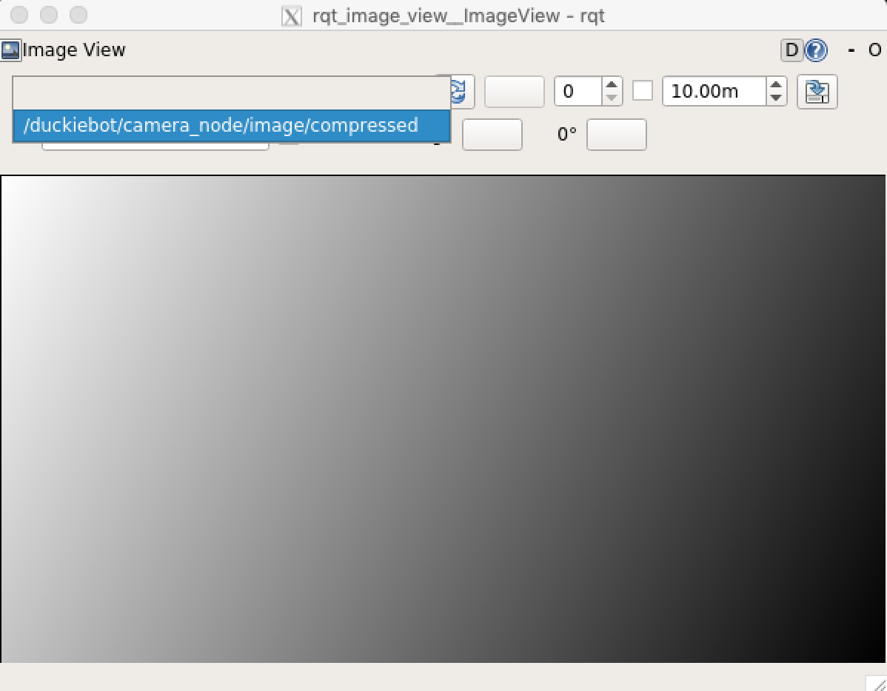

# See what your Duckiebot sees {#read-camera-data status=ready}

Requires: A Duckiebot in `DB18` configuration.

Requires: Laptop configured, according to .

Requires: You have configured the Duckiebot as documented in .

Result: You can see the output of the camera.

## Check the camera hardware

It might be useful to do a quick camera hardware check as documented in .

## Viewing an Image Stream on Your Laptop {#view-image-using-rqt-image-view}

The imagery is streaming from your Duckiebot by default on startup.
To see it, run a base image on your laptop with:

    laptop $ dts start_gui_tools ![DUCKIEBOT_NAME]

The container will start. At the prompt, run:

    container $ rqt_image_view

The command should open a window where you can view the image.
You have to select the right topic from the dropdown menu:

<figure>
    <figcaption>The rqt image view window with dropdown menu</figcaption>
    
</figure>

### Troubleshooting

Symptom: When I try to do `rqt_image_view`, I don't see the window on my machine.

Resolution: Sometimes window does not successfully spawn on the first try. You can Ctrl+c to terminate the prcess first, and try running that process again.

Symptom: I don't see any image

Reolution: use `rostopic hz /![hostname]/camera_node/image/compressed` and see if the image is being published. Typically, the image publish rate should be near 30hz.

See also: For more information about `rostopic`, see .

Sumptom: My image topic is not being published.

Resolution: Check that the `duckiebot-interface` is running

Open [the Portainer interface](#docker-setup-portainer-interface) and check the running containers. You should see one called `duckiebot-interface`, using image `duckietown/dt-duckiebot-interface:daffy-arm32v7`.

You call also determine this by running:

    $ docker -H ![DUCKIEBOT_NAME].local ps

and look at the output to find the Duckiebot interface container and verify that it is running.

If that image is not running, you should manually start that or check to see if you `init_sd_card` procedure was correct.

To manually start the `duckiebot-interface`, do:

    laptop $ docker -H ![DUCKIEBOT_NAME].local run --name duckiebot-interface -v /data:/data --privileged --network=host -dit --restart unless-stopped duckietown/dt-duckiebot-interface:daffy-arm32v7

## Viewing the image stream on the Dashboard {#image-dashboard status=ready}

If you followed the instructions in , you
should have access to the Duckiebot dashboard.

Open the browser and visit the page `http://![hostname].local/`. Login using your duckietown token, and select robot panel on the left hand side navigation bar. Once selected you should see mission control page there. If you are unfamiliar with the dasboard, you can find more information here: 

The bottom of the page shows the camera block.
You should be able to see the camera feed in the camera block,
as shown in the image below.

  

By default, the camera stream is throttled down to 8 frames per second.
This is to minimize the resources used by your browser while streaming
images from the robot.
Feel free to increase the data stream frequency in the **Properties** tab
of the camera block.

Note: If you see a black image in the camera block, make sure that you
removed the protective cap that covers the camera lens of your Duckiebot.

## Viewing the image in no-vnc {#image-novnc status=ready}

For instructions using the no-vnc tool, see 
