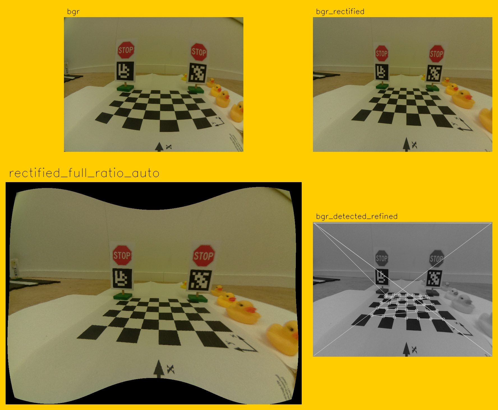
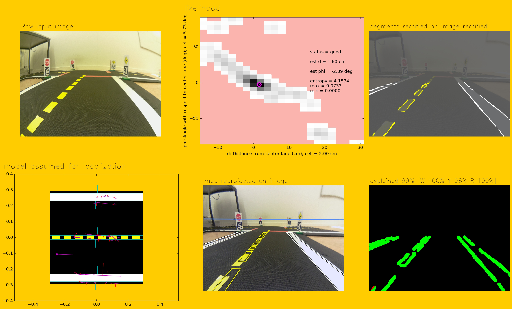
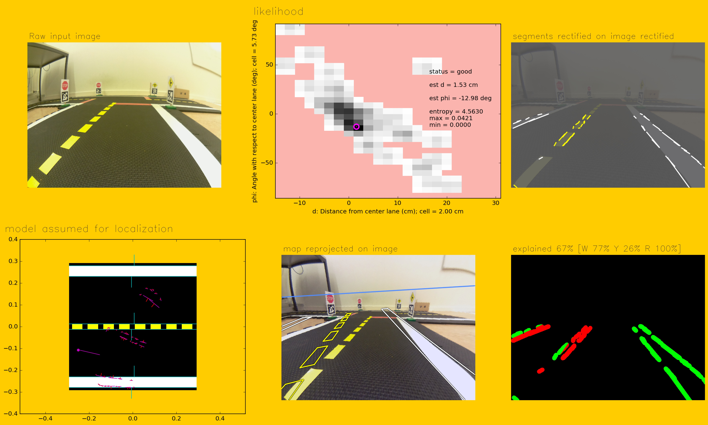
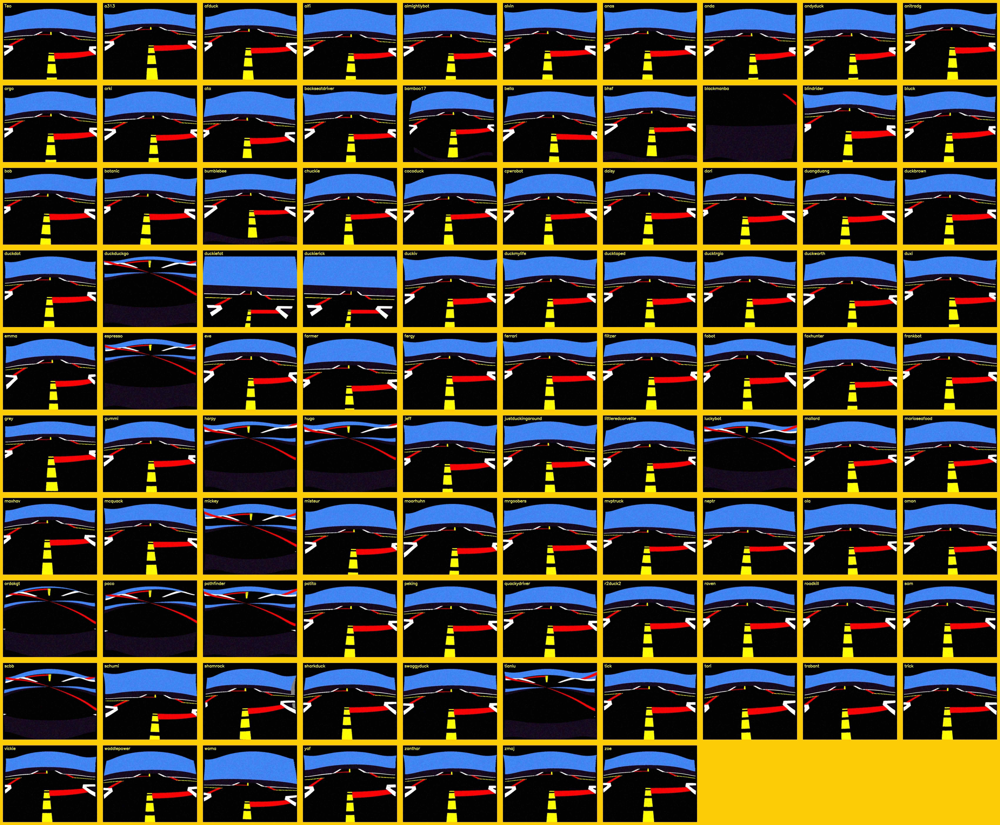

# Camera calibration and validation {#camera-calib status=ready}

This section describes the instrinsics and extrinsics calibration procedures.

<div class='requirements' markdown='1'>

Requires: You can see the camera image on the laptop. The procedure is documented in
[](#read-camera-data).

Results: That your camera intrinsics and extrinsics are calibrated and stored on the duckiebot.

</div>


## Materials {#camera-calibration-pattern-materials}

If you do not have one already, download and print a PDF of the calibration checkerboard:

- [A3-format](https://github.com/duckietown/Software/blob/master18/catkin_ws/src/00-infrastructure/duckietown/config/baseline/calibration/camera_intrinsic/calibration_pattern.pdf).


<div figure-id="fig:calibration_checkerboard" figure-caption="">
     
</div>

Note: the squares must have side equal to 0.031 m = 3.1 cm. Please measure this, as having the wrong size will make your Duckiebot crash.

Note: In case your squares are not of the right size, make sure your printer settings are on A3 format, no automatic scaling, 100% size.

Fix the checkerboard to a rigid planar surface that you can move around.

Warning: If the pattern is not rigid the calibration will be useless. You can print on thick paper or adhere to something rigid to achieve this.


### Optional material

You will also need a "lane" during the extrinsics calibration procedure.
This is not 100% necessary.


## Intrinsic Calibration

Every camera is a little bit different so we need to do a camera calibration procedure to account for the small manufacturing discrepancies.
This process will involve displaying a predetermined pattern to the camera and using it to solve for the camera parameters. For more information on the details see [the slides](https://github.com/duckietown/lectures/blob/master/1_ideal/25_computer_vision/cv_calibration.pdf).
The procedure is basically a wrapper around the [ROS camera calibration tool](http://wiki.ros.org/camera_calibration).

### Launch the intrinsic calibration application

Next you can launch the intrinsic calibration program with:

    laptop $ dts duckiebot calibrate_intrinsics ![DUCKIEBOT_NAME]
    

You should see a display screen open on the laptop ([](#fig:intrinsic_callibration_pre)).

<div figure-id="fig:intrinsic_callibration_pre" figure-caption="">
     
</div>

Note: If you only see a window with black screen during the startup, try to resize the window manually using cursor, and you should see the window content correctly. 

### Calibration dance

Position the checkerboard in front of the camera until you see colored lines
overlaying the checkerboard. You will only see the colored lines if the entire
checkerboard is within the field of view of the camera.

You should also see
colored bars in the sidebar of the display window. These bars indicate the
current range of the checkerboard in the camera's field of view:

- X bar: the observed horizontal range (left - right)
- Y bar: the observed vertical range (top - bottom)
- Size bar: the observed range in the checkerboard size (forward - backward from the camera direction)
- Skew bar: the relative tilt between the checkerboard and the camera direction

Also, make sure to focus the image by rotating the mechanical focus ring on the lens of the camera.

Warning: Do not touch the focus anymore, ever, as it will invalidate calibration.


Now move the checkerboard right/left, up/down, and tilt the checkerboard
through various angles of relative to the image plane. After each movement,
make sure to pause long enough for the checkerboard to become highlighted. Once
you have collected enough data, all four indicator bars will turn green. Press
the "CALIBRATE" button in the sidebar.

Calibration may take a few moments. Note that the screen may dim. Don't worry, the calibration is working.

<div figure-id="fig:intrinsic_calibration_calibratestep" figure-caption="">
 
</div>


### Save the calibration results

If you are satisfied with the calibration, you can save the results by pressing the "COMMIT" button in the side bar. (You never need to click the "SAVE" button.)

<div figure-id="fig:intrinsic_calibration_commit" figure-caption="">
     
</div>

This will automatically save the calibration results on your Duckiebot:

```
/data/config/calibrations/camera_intrinsic/![hostname].yaml
```

If you are running the file server through docker (which runs by default) you can view or download the calibration file at the address:

`http://![DUCKIEBOT_NAME].local:8082/config/calibrations/camera_intrinsic/![DUCKIEBOT_NAME].yaml`

Additionally, you can access your calibration files through dashboard. Read more [here](#dashboard-tutorial-files)

### Keeping your calibration valid

Warning: Do not change the focus during or after the calibration, otherwise your calibration is no longer valid.

Warning: Do not use the lens cover anymore; removing the lens cover may change the focus.


### Cleanup

You can now stop the `demo_intrinsic_calibration` on the robot either through the portainer interface or by typing:

     laptop $ docker -H ![DUCKIEBOT_NAME].local stop demo_intrinsic_calibration


## Extrinsic Camera Calibration {#extrinsic-camera-calibration}


### Setup {#camera-calib-jan18-extrinsics-setup}

Arrange the Duckiebot and checkerboard according to [](#fig:extrinsic_setup2). Note that the axis of the wheels should be aligned with the y-axis.

<div figure-id="fig:extrinsic_setup2" figure-caption="">
  
</div>


[](#fig:extrinsic_view2) shows a view of the calibration checkerboard from the Duckiebot. To ensure proper calibration there should be no clutter in the background.

<div figure-id="fig:extrinsic_view2" figure-caption="">
  
</div>


### Launch the extrinsic calibration pipeline

Run:

    laptop $ dts duckiebot calibrate_extrinsics ![DUCKIEBOT_NAME] 

First the output will instruct you place your robot on the calibration box and press <kbd>Enter</kbd>. 
If all goes well the program will complete.

This will automatically save the calibration results on your Duckiebot:

```
/data/config/calibrations/camera_extrinsic/![DUCKIEBOT_NAME].yaml
```

If you are running the file server through docker you can view or download the calibration file at the address: 

`http://![DUCKIEBOT_NAME].local:8082/config/calibrations/camera_extrinsic/![DUCKIEBOT_NAME].yaml`


#### Troubleshooting

Symptom: You see a long complicated error message that ends with something about `findChessBoardCorners failed`. 

Resolution: Your camera is not viewing the full checkerboard pattern. You can verify this by going to the file `http://![DUCKIEBOT_NAME].local:8082` and navigate into the folder `out-calibrate-extrinsics-![DUCKIEBOT_NAME]-20...` and click on `all.jpg` to see the pictures that were taken. Most likely part of the chess board pattern is occluded. Possibly you didn't assemble your Duckiebot correctly or you did not put it on the calibration pattern properly.


### Manual verification of the Results


You can view or download the files at

`http://![DUCKIEBOT_NAME].local:8082/`


In that directory there are the results of the testing and the actual calibration files. The calibration file is at

`http://![DUCKIEBOT_NAME].local:8082/config/calibrations/camera_extrinsic/![DUCKIEBOT_NAME].yaml`

You can also see the output of the diagnostics at

`http://![DUCKIEBOT_NAME].local:8082/out-calibrate-extrinsics-YYYYMMDDHHMMSS/`


It should look like [](#fig:calibrate_extrinsics1).

<div figure-id="fig:calibrate_extrinsics1" figure-caption="">
  
</div>

Note the difference between the two types of rectification:

1. In `bgr_rectified` the rectified frame coordinates are chosen so that
the frame is filled entirely. Note the image is stretched - the April tags
are not square. This is the rectification used in the lane localization pipeline. It doesn't matter that the image is stretched, because the homography learned will account for that deformation.

2. In `rectified_full_ratio_auto` the image is not stretched. The camera matrix is preserved. This means that the aspect ratio is the same. In particular note the April tags are square. If you do something with April tags, you need this rectification.

<!--
### Optional autonomic verification step

By default, the extrinsic calibration pipeline will now ask you to put your robot on a lane to complete a verification step.

This step needs a Duckietown lane. If you don't have it, skip it by add `--no_verification` to the `dts duckiebot calibrate_extrinsics ![DUCKIEBOT_NAME] ... ` command above. 

To do the validation, place the robot in a lane when instructed.

What this does is taking one snapshot and performing localization on that single image.

The output will be useful to check that everything is ok.

You can see the output of the diagnostics at

    http://![DUCKIEBOT_NAME].local:8082/out-pipeline-![DUCKIEBOT_NAME]-YYYYMMDDHHMMSS/

[](#fig:oneshot1_all) is an example in which the calibration was correct, and the robot
localizes perfectly.

<div figure-id="fig:oneshot1_all">
    
    <figcaption>Output when camera is properly calibrated.</figcaption>
</div>


Look at the output in the bottom left of [](#fig:incorrect1): clearly the perspective is distorted,
and there is no way for the robot to localize given the perspective points.

<div figure-id="fig:incorrect1">
    
    <figcaption>Output when camera not properly calibrated.</figcaption>
</div>


Validation is useful because otherwise it is hard to detect wrong calibrations.

For example, in 2017, a bug in the calibration made about 5 percent
of the calibrations useless ([](#fig:calibration_95_percent_success)), and people didn't notice for weeks (!).


<div figure-id="fig:calibration_95_percent_success">
    
    <figcaption>In 2017, a bug in the calibration made about 5 percent
    of the calibrations useless.</figcaption>
</div>
-->