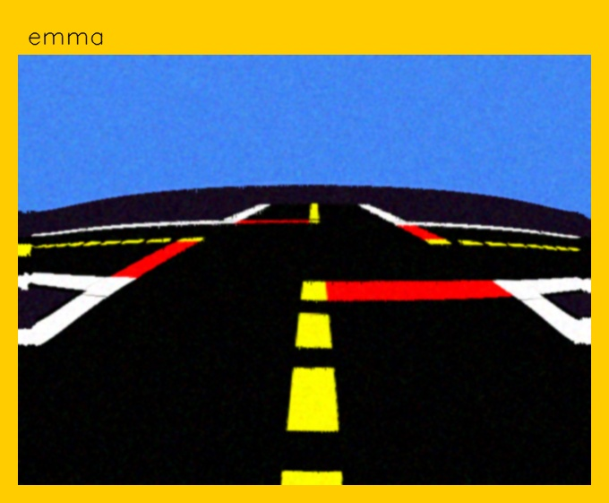
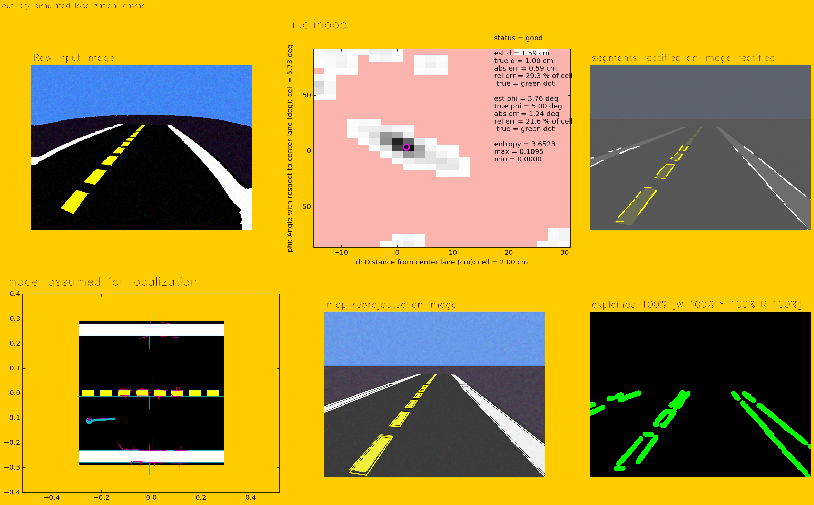

# Camera calibration and validation {#camera-calib status=ready}

<div class='requirements' markdown='1'>

​    

Requires: You can see the camera image on the laptop. The procedure is documented in
[](#read-camera-data).

Results: Calibration for the robot camera.

</div>

## Intrinsic Camera Calibration {#intrinsic-camera-calibration}

### Setup

Download and print a PDF of the calibration checkerboard [US Letter](https://github.com/duckietown/Software/blob/master18/catkin_ws/src/00-infrastructure/duckietown/config/baseline/calibration/camera_intrinsic/calibration_pattern.pdf)).
Fix the checkerboard to a planar surface.

<div figure-id="fig:calibration_checkerboard" figure-caption="">
     
</div>

Download and print a PDF of the calibration checkerboard.

Note: the squares must have side equal to 0.031 m = 3.1 cm. Please measure this, as having the wrong size will make your Duckiebot crash.


Fix the checkerboard to a planar surface.

### Calibration

Make sure your Duckiebot is on, and both your laptop and Duckiebot are connected to the duckietown network.

These commands assume that you have completed the steps in [](#docker-setup),
and in particular that you set `DOCKER_HOST` correctly and can use `docker ps` successfully.
 
 
#### Docker

Make sure your camera is on and the images are being published to ROS
using the `rpi-duckiebot-ros-picam` container:

    laptop $ docker run -it --name ros-picam --net host --privileged -v /data:/data duckietown/rpi-duckiebot-ros-picam:master18 
    

On your laptop run:

    laptop $ dts calibrate ![DUCKIEBOT_NAME]

Hit <kbd>Enter</kbd>.


#### ROS {status=deprecated}

Open two terminals on the laptop. In the first terminal, log in into your robot using SSH and launch the camera process:


    duckiebot $ cd ![duckietown root]
    duckiebot $ source environment.sh
    duckiebot $ roslaunch duckietown camera.launch veh:=![robot name] raw:=true


In the second laptop terminal run the camera calibration:


    laptop $ cd ![duckietown root]
    laptop $ source environment.sh
    laptop $ source set_ros_master.sh ![robot name]
    laptop $ roslaunch duckietown intrinsic_calibration.launch veh:=![duckiebot name]


Whether you did the Docker way or the ROS way you should see a display screen open on the laptop ([](#fig:intrinsic_callibration_pre)).

<div figure-id="fig:intrinsic_callibration_pre" figure-caption="">
     
</div>

Position the checkerboard in front of the camera until you see colored lines
overlaying the checkerboard. You will only see the colored lines if the entire
checkerboard is within the field of view of the camera.

You should also see
colored bars in the sidebar of the display window. These bars indicate the
current range of the checkerboard in the camera's field of view:

- X bar: the observed horizontal range (left - right)
- Y bar: the observed vertical range (top - bottom)
- Size bar: the observed range in the checkerboard size (forward - backward from the camera direction)
- Skew bar: the relative tilt between the checkerboard and the camera direction

Also, make sure to focus the image by rotating the mechanical focus ring on the lens of the camera.

Comment: Do not change the focus during or after the calibration, otherwise your calibration is no longer valid. I'd also suggest to not to use the lens cover anymore; removing the lens cover changes the focus. -MK

Now move the checkerboard right/left, up/down, and tilt the checkerboard
through various angles of relative to the image plane. After each movement,
make sure to pause long enough for the checkerboard to become highlighted. Once
you have collected enough data, all four indicator bars will turn green. Press
the "CALIBRATE" button in the sidebar.

Calibration may take a few moments. Note that the screen may dim. Don't worry, the calibration is working.

<div figure-id="fig:intrinsic_calibration_calibratestep" figure-caption="">
 
</div>

### Save the calibration results

If you are satisfied with the calibration, you can save the results by pressing the "COMMIT" button in the side bar. (You never need to click the "SAVE" button.)

<div figure-id="fig:intrinsic_calibration_commit" figure-caption="">
     
</div>

This will automatically save the calibration results on your Duckiebot:

```
/data/config calibrations/camera_intrinsic/![duckiebot name].yaml
```

If you are running the file server through docker you can view or download the calibration file at the address: `http://![duckiebot name].local:8082/config/calibrations/camera_intrinsic/![duckiebot name].yaml`


## Extrinsic Camera Calibration {#extrinsic-camera-calibration}


### Setup {#camera-calib-jan18-extrinsics-setup}

Arrange the Duckiebot and checkerboard according to [](#fig:extrinsic_setup2). Note that the axis of the wheels should be aligned with the y-axis ([](#fig:extrinsic_setup2)).

<div figure-id="fig:extrinsic_setup2" figure-caption="">
  
</div>


[](#fig:extrinsic_view2) shows a view of the calibration checkerboard from the Duckiebot. To ensure proper calibration there should be no clutter in the background and two A4 papers should be aligned next to each other.

<div figure-id="fig:extrinsic_view2" figure-caption="">
  
</div>


### Calibration


### Docker

If you ran `dts calibrate ![duckiebot name]` then the same terminal will immediately take you into the extrinsic calibration step. After the following Setup step, push <kbd>Enter</kbd>.


### ROS - Extrinsic calibration procedure {#camera-calib-jan18-extrinsics status=deprecated}

Run the following on the Duckiebot:

    duckiebot $ rosrun complete_image_pipeline calibrate_extrinsics
    
Followed by the following command for verification:

    duckiebot $ rosrun complete_image_pipeline single_image_pipeline


### Verifying the Results

#### Docker

If you are running the file server you can view or download the files at `http://![duckiebot name].local:8082/`
In that directory there are the results of the testing and the actual calibration files. The calibration file is at `http://![duckiebot name].local:8082/config/calibrations/camera_extrinsic/![duckiebot name].yaml`

You can also see the output of the diagnostics at `http://![duckiebot name].local:8082/out-calibrate-extrinsics-YYYYMMDDHHMMSS/`


It should look like [](#fig:calibrate_extrinsics1).


<div figure-id="fig:calibrate_extrinsics1" figure-caption="">
  
</div>

Note the difference between the two types of rectification:

1. In `bgr_rectified` the rectified frame coordinates are chosen so that
the frame is filled entirely. Note the image is stretched - the April tags
are not square. This is the rectification used in the lane localization pipeline. It doesn't matter that the image is stretched, because the homography learned will account for that deformation.

2. In `rectified_full_ratio_auto` the image is not stretched. The camera matrix is preserved. This means that the aspect ratio is the same. In particular note the April tags are square. If you do something with April tags, you need this rectification.

<!-- Currently not working
 ## Camera validation by simulation {#camera-calib-jan18-simulation}

TODO: Add this to container

You can run the following command to make sure that the camera calibration is reasonable:

    duckiebot $ rosrun complete_image_pipeline validate_calibration

What this does is simulating what the robot should see, if the models were correct ([](#fig:validate_calibration_out1)).

<div figure-id="fig:validate_calibration_out1">
    
    <figcaption>Result of <code>validate_calibration</code>.</figcaption>
</div>

Then it also tries to localize on the simulated data ([](#fig:try_simulated_localization)).
It usual achieves impressive calibration results!

> Simulations are doomed to succeed.

<div figure-id="fig:try_simulated_localization">
    
    <figcaption>Output of <code>validate_calibration</code>: localization
    in simulated environment.</figcaption>
</div>
-->


Next Place the robot in a lane.


What this does is taking one snapshot and performing localization on that single image.
The output will be useful to check that everything is ok.

[](#fig:oneshot1_all) is an example in which the calibration was correct, and the robot
localizes perfectly.

<div figure-id="fig:oneshot1_all">
    
    <figcaption>Output when camera is properly calibrated.</figcaption>
</div>


Look at the output in the bottom left of [](#fig:incorrect1): clearly the perspective is distorted,
and there is no way for the robot to localize given the perspective points.

<div figure-id="fig:incorrect1">
    
    <figcaption>Output when camera not properly calibrated.</figcaption>
</div>


Validation is useful because otherwise it is hard to detect wrong calibrations.

For example, in 2017, a bug in the calibration made about 5 percent
of the calibrations useless ([](#fig:calibration_95_percent_success)), and people didn't notice for weeks (!).


<div figure-id="fig:calibration_95_percent_success">
    
    <figcaption>In 2017, a bug in the calibration made about 5 percent
    of the calibrations useless.</figcaption>
</div>
