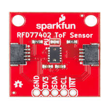
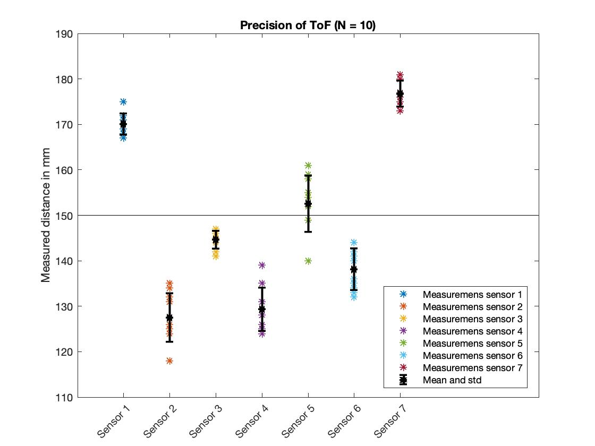
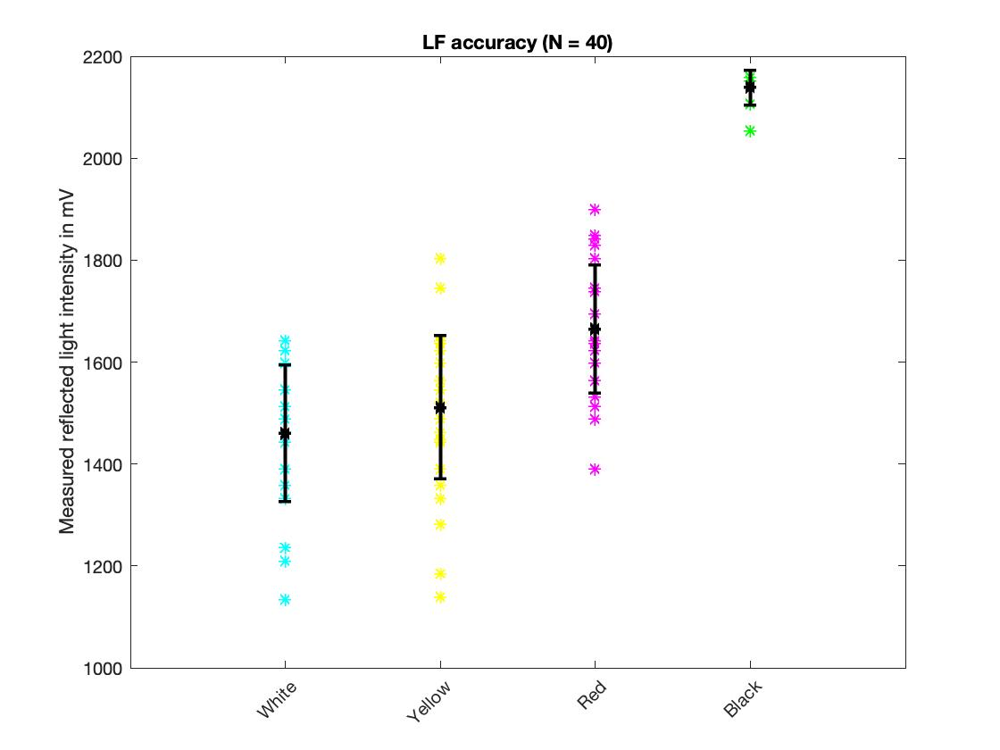
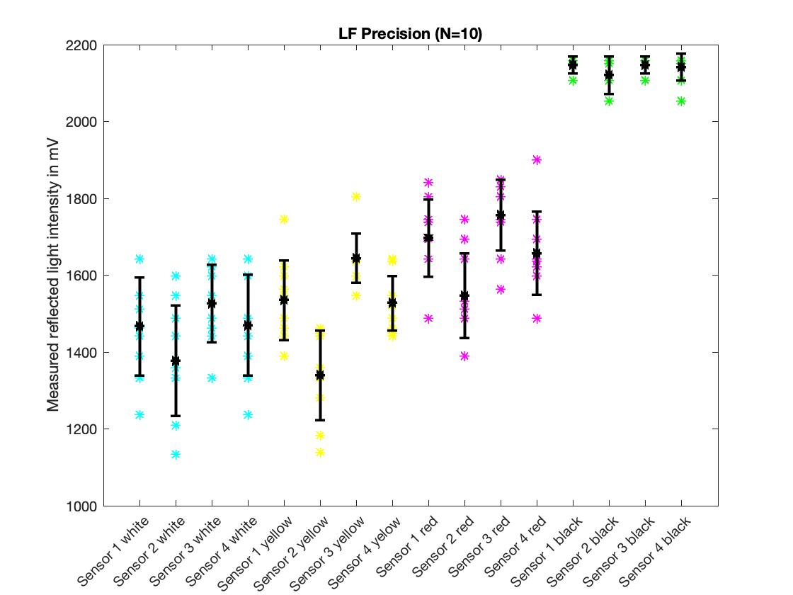
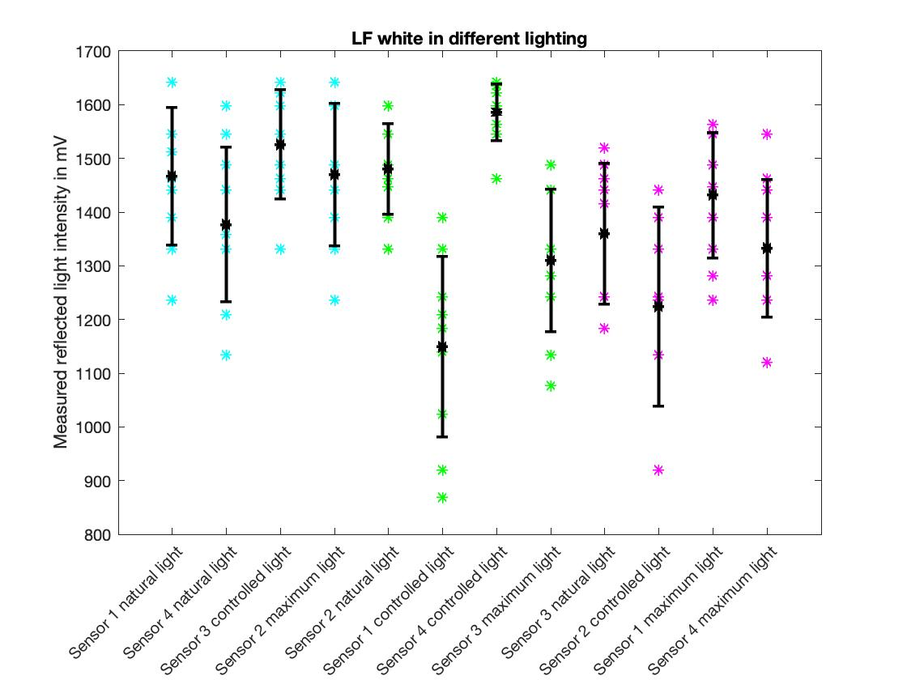
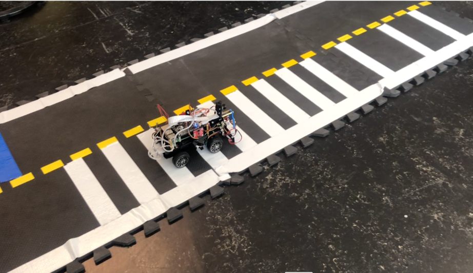
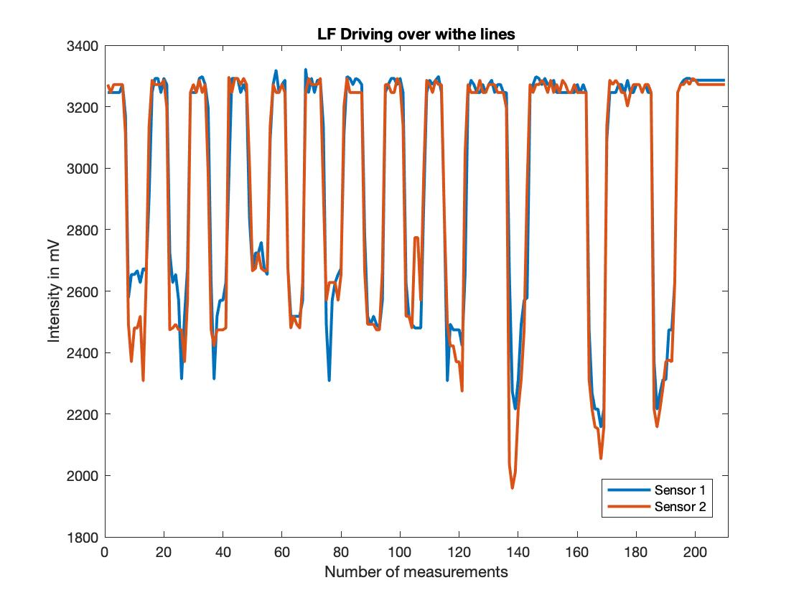
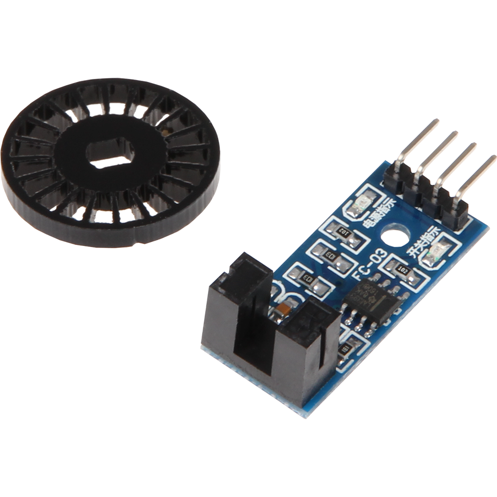
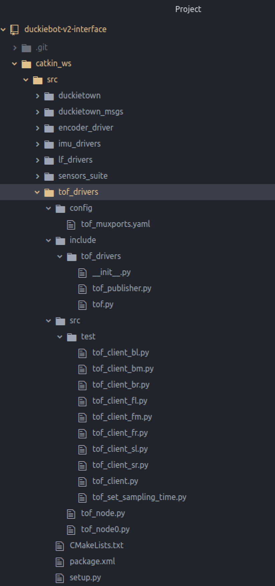
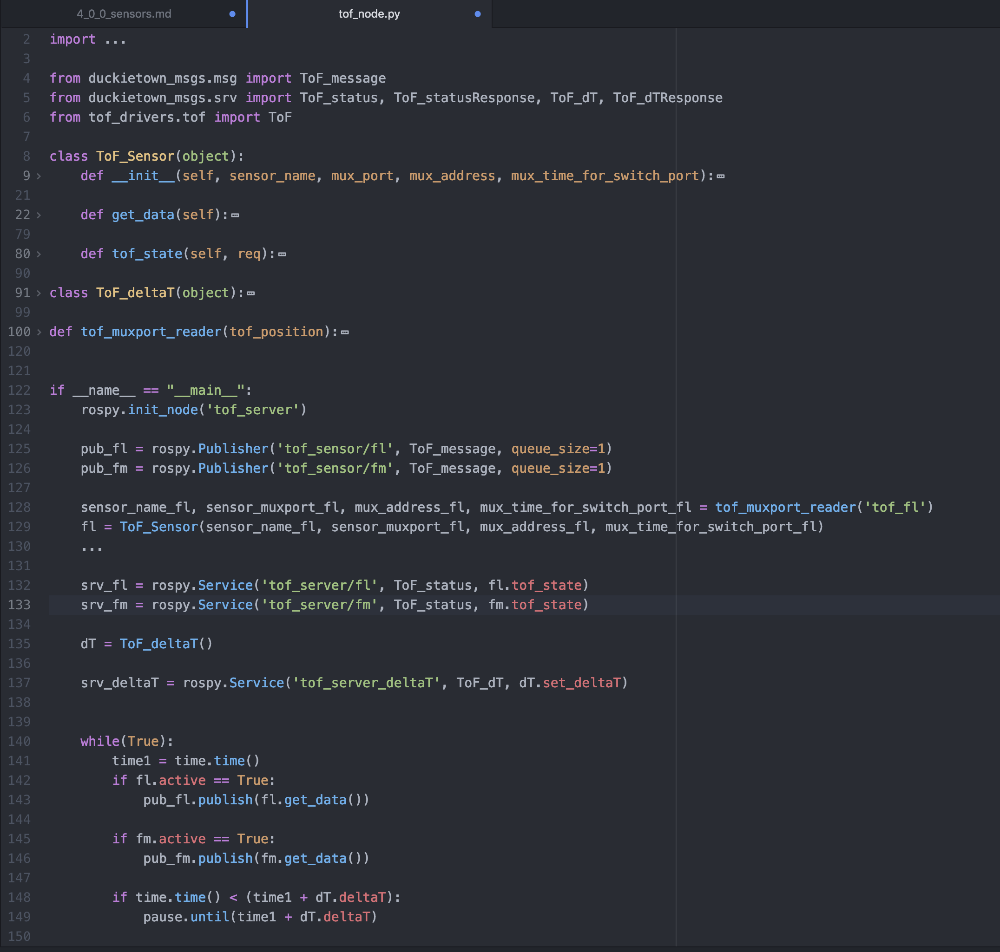

# Sensors {#Additional_sensors status=ready}

Requires: A `DBv2` with the following sensors: time of flight, line follower, IMU, wheel encoder and camera

Result: This page explains the sensors of the `DBv2`.

## Time of Flight (ToF)

To measure distances, a time of flight sensor can be used. The sensor sends out a signal and measures the time the signal needs to return. Knowing the propagation speed of the signal and the time it needs to come back, it is possible to calculate the traveled distance. For the `DBv2`, the spark fun RFD77402 sensor is used. According to the data-sheet the sensor has a distance range of 2 m with a precision of (+/-) 10% and an opening angle  of 55 degree.

Further information about the RFD77402 chip can be found on the [SparkFun website](https://www.sparkfun.com/products/14539)

<figure>
    <figcaption>Time of flight sensor RFD77402</figcaption>
    
</figure>

### Validation
To verify the distance measurements of the time of flight sensors, seven different sensors were placed in three different distances to a cardboard surface. The distances were 10 cm, 15 cm and 20 cm. With each sensor 10 measurements have been taken, so 70 measurements in total. The measurements are plotted in . By a distance of 15 cm the measuring points are scattered between 11.8 cm and 18.1 cm. Also in the other two data series a range of multiple cm for the measurement points was detected.

     

To verify the precision of the sensors, the results of measuring a distance of 15 cm are plotted for each sensor. See . The distribution of the measurements points of one sensor are not scattered over several cm any more, they are separated in a range of mm. Knowing this, the sensors must be calibrated in future.

     

According to the data-sheet the time of flight sensor should have an opening angle of 55 degree. To verify that, the `DBv2` was placed in the center of a circle with radius 27.5 cm. Then a box with the width of 4 cm and height of 28 cm surrounded with white duckietown tap was placed in front of the front middle time of flight sensor. So that the middle of the box, the front middle time of flight sensor and the center of the circle are in one straight line. Let's define that point as 0°. We placed the box at 5°, 15°, 25°, ..., 355° and measured which sensors can detect the box.

The box has a width of 5°. An opening angle of 40° was measured. The areas where the `DBv2` detects objects are marked green in .

     

<!-- <table style="width:100%">
 <tr>
   <th>True Distance [mm]</th>
   <td>100</th>
   <td>150</th>
   <td>200</th>
 </tr>
 <tr>
   <th>Mean [mm]</td>
   <td>94.36</td>
   <td>148.43</td>
   <td>198.67</td>
 </tr>
 <tr>
   <th>Standard deviation</td>
   <td>19.92</td>
   <td>18.39</td>
   <td>17.73</td>
 </tr>
</table> -->

<!-- <table style="width:100%">
 <tr>
   <th></th>
   <th>Sensor 1</th>
   <th>Sensor 2</th>
   <th>Sensor 3</th>
   <th>Sensor 4</th>
   <th>Sensor 5</th>
   <th>Sensor 6</th>
   <th>Sensor 7</th>

 </tr>
 <tr>
   <th>Mean [mm]</td>
   <td>170.1</td>
   <td>127.5</td>
   <td>144.6</td>
   <td>129.3</td>
   <td>152.6</td>
   <td>138.1</td>
   <td>176.8</td>
 </tr>
 <tr>
   <th>Standard deviation</td>
   <td>2.33</td>
   <td>5.34</td>
   <td>1.96</td>
   <td>4.76</td>
   <td>6.20</td>
   <td>4.61</td>
   <td>2.90</td>
 </tr>
</table> -->

### How to run the code for the time of flight sensor

To get the measurement of the time of flight call the tof_node with the position name of the sensor you want to measure the distance from

    $docker -H [DUCKIEBOT_NAME].local run --privileged -it --net host --rm --name sensors-test duckietown/duckiebot-v2-interface

Open a second terminal:

    $docker -H [DUCKIEBOT_NAME].local exec -it sensors-test /bin/bash

    $. catkin_ws/devel/setup.bash

    $rosservice call /tof_measurement "sensor_position: '[position name]'";

The results of a measurement are stored in the message ToFMesurements. One measurement returns the following values: the distance in mm, the confidence value, the valid pixels and a timestamp when the measurement was taken. The confidence value and the valid pixels are values of the confidence register and depend on the detected signal amplitude. The confidence value is an integer between 0 and 2047, where 2047 is the "most confident". It was observed, that when no object was in a range of 2 m to a time of flight sensor, still a distance was measured. The confidence value was then a number lower then 100. Probably the distance to the ground is measured. So we advise you, to check that the confidence value is higher than 100.

Position names:
<col2 figure-id="tab:tof_positions" figure-caption="Position names of the time of flight sensors" class="labels-row1">
    Position name
    Explanation
    fl
    time of flight front left
    fm
    time of flight front middle
    fr
    time of flight front right
    sl
    time of flight side left
    sr
    time of flight side right
    bl
    time of flight side right
    bl
    time of flight back left
    bm
    time of flight back middle
    br
    time of flight back right
</col2>

## Line Following Sensor (LF)
Line following sensors can detect lines or nearby objects. The sensor detects reflected light coming from its own infrared LED. Through measuring the intensity of the reflected light, transitions from dark to light can be detected. The measured intensity is fed back as an analog signal to the micro controller of the DBv2 hat.

For the DBv2 we use the line following sensor QRE1113 from SparkFun. You can find further information [here](https://www.sparkfun.com/products/9453).

<figure>
    <figcaption>Line follower QRE1113</figcaption>
    
</figure>

### Validation

To validate the measurement data of the line following sensors, the `DBv2` was placed on four different colors. First we set the `DBv2` on white tape, then on yellow tape, red tape and at the end on a the black tile. The measurements were taken with four different sensors. Each sensor made 10 measurements, so we have 40 measurements in total.
To remove the bias from the last measurement we have to move the bot a little bit. In  the results are plotted. There is a clear difference in voltage between the three colors white, yellow, red and the black tile. Distinguish the colors white, yellow and red is not possible. This was to expect, as we have a line following sensor and not a color detection sensor. In  the measurements of all sensors are plotted again. We can see the difference between the different sensors. We observe that they are all in a very similar voltage range and that the difference between white and black is roughly 700 mV.

     

     

Next, it was tested how illumination effects the measurements. For that the `DBv2` was placed on white tape and a black tile in three different exposure of light: natural sunlight, controlled light and maximum light. In  and  it can bee seen that the room light does not affect the sensors very much. There might be a voltage shift of some 100 mV. But the difference in the voltage level between black and white is with roughly 700 mV much higher.

     

     

At last, it is of interest, if the lines can be detected when the `DBv2` drives over them. For that two sensors measured while the duckiebot drove over white lines. The setup is documented in . As one can see in  the thickness between the white tape changes.
The measurements are plotted in  . There is a sharp transition between black and white.

Notice that the voltage level of this measurements is much higher, due to different soldering of the sensors. This is the reason why the black and withe voltage levels should be calibrated for each sensor.

     

     

## How to run the code for the line follower
To get a measurement from the line following sensor start the rosservice server lf_node

    $docker -H [DUCKIEBOT_NAME].local run --privileged -it --net host --rm --name sensors-test duckietown/duckiebot-v2-interface

To get the measurement of the line following sensor call the rosservice lf_node with the position name of the sensor you want to measure the distance from

    $docker -H [DUCKIEBOT_NAME].local run --privileged -it --net host --rm --name sensors-test duckietown/duckiebot-v2-interface

Open a second terminal and ask for the measurement as a ros service client:

    $docker -H [DUCKIEBOT_NAME].local exec -it sensors-test /bin/bash

    $. catkin_ws/devel/setup.bash

    $rosservice call /lf_measurement "sensor_position: '[position name]'";

In the message LFMeasurements the voltage level mV and the timestamp are stored.
In `DBv2` four line following sensors can be plugged in, to distinguish them they are named as defined in 

<col2 figure-id="tab:lf_positions" figure-caption="Line follower position names" class="labels-row1">
    Position name
    Explanation
    lf_il
    line follower inner left
    lf_ol
    line follower outer left
    lf_ir
    line follower inner right
    lf_or
    line follower dbv2jetfire
    outer right
</col2>

## Inertial Measurement Unit (IMU)

An inertial measurement unit (IMU) is a sensor that measures acceleration, angular rate and the orientation of the body, using accelerometers, gyroscopes and magnetometers.The accelerometer uses a fork-like structure, forming a capacitor that has the size of a few micrometers only. Both parts of the structure are connected rigidly to the base of the sensor with a very tiny rod each. With this setup, the two parts can be moved towards each other. When the sensor is moved, not only the distance between the spikes of the fork changes but the capacity of the whole structure does so as well. This change in capacity can then be measured and transformed into a digital signal.

With all these features combined into one sensor, we have everything we need to determine our state in space and can note any subsequent change in this state. For the `DBv2` we are using the Spark Fun IMU Breakout MPU-9250. For further information visite the [SparkFun website](https://www.sparkfun.com/products/13762)

<figure>
    <figcaption>Line follower QRE1113</figcaption>
    
</figure>

### How to run the code for the IMU
In the message IMUMeasurements the results of the IMU measurements are saved. We measure the acceleration in g for the three axis x, y and z. Then the rotation is measured in degrees per second. Followed by measuring the magnetic field in uT. In the end, the temperature of the sensor is measured. The timestamps when the measurements from the accelerometer, the gyro and the magnetometer are also stored in the IMUMeasurement message.

## Camera

## Wheel Encoder
The wheel encoder can measure the traveled distance and the speed. How does that work? The wheel encoder we are using sends out a light signal and detects it on the other side with a photo diode. If the light beam gets interrupted the digital output signal of the diode is pulled LOW (0). If the light beam can be detected the output signal is HIGH (1). On the `DBv2` a 3D printed wheel with well-defined hole sizes is mounted on the back axle. The wheel is mounted in the middle between the light source and the photo diode. When the `DBv2` is driving, the number of rising and falling edges can be counted per rotation of the wheel. So that the driving speed and the traveled distance can be calculated.
<!--
Sensor: LM393

Website https://joy-it.net/en/products/SEN-Speed
-->
<figure>
    <figcaption>Wheel encoder</figcaption>
    
</figure>

### How to run the code for the wheel encoder

### Validation

To validate the wheel encoder measurements, the duckiebot was pushed 15 cm, 50 cm and 100 cm by hand over the tile. Based on the number of switches the wheel encoder counted from 0 to 1 and from 1 to 0 the traveled distance was calculated. The formula to calculate the traveled distance is:

\begin{equation}
    2 \pi r \dfrac{ticks}{N}
\end{equation}

The results of this experiment can be seen in . As the `DBv2` was moved by hand, there is a big insecurity in the really traveled distance.

    

## Sensor Suite
The sensor suite node scans through all sensor which are available for the `DBv2` and detects which sensors are plugged in. The sensors must be plugged in as stated in the construction manual. It won’t detect a time of flight sensor at the IMU plug.

The sensor suite first tests if the raspberry pi can communicate via I2C with the sensor. Secondly, it checks the chip ID. The chip ID is unique for each sensor type. In future we can use the chip ID to differentiate between different sensors in the same sensor classes. (For example, if we use different types of time of flight sensors.)

Note: If the front bumper is not connected to the raspberry pi, the time of flight sensors and the line following sensors can’t be detected, as they communicate over the front bumper.

### How to run the code for the sensor suite

## Code structure
In this section we want to give you a short overview how to include new sensors to the `DBv2`.

The code for the sensors is structured as shown in . Each sensor class has a folder called sensor-name_dirvers. In this folder there are three subfolders: config, include and src.

In the config folder the .yaml files are stored. In the yaml-file all parameters that can be changed are defined. For example the multiplexer-ports for each time of flight sensor.

The subfolder include contains all the code used for a specific sensor type. As an example, in the folder tof_drivers the code to take measurements with the time of flight sensor RFD77402 are stored. The code that takes measurements should not depend on code outside of this folder. It should be stand alone. So also no ROS commands should be used. If you use code from an other person to read out the data of a sensor, make sure to save the license files in this folder as well.

The scr folder is where everything comes together. The sensor_node is the main code section for each sensor. As they are all written in a similar way, let's have a look at tof_node. See . The class ToF_Sensor contains a function that gets the measurements and a service function tof_state. In the tof_state function the attribute active is set. If active is True, the sensor will take measurements. The class ToF_deltaT handles the service, that sets the minimal time between two measurements. In the main function we first define the messages published by the sensors. Every sensor has its own message, so one can call the measurements from one specific sensor. Then we read out all variables, which are stored in the yaml file and create an object of the class ToF_Sensor. In a next step, the service to turn on and off the tof_state. Then the service to change the delta T is created. At the end, measurements from the sensors with an active state are taken.

    

    

