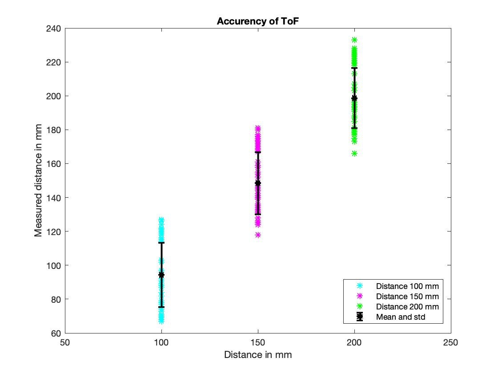
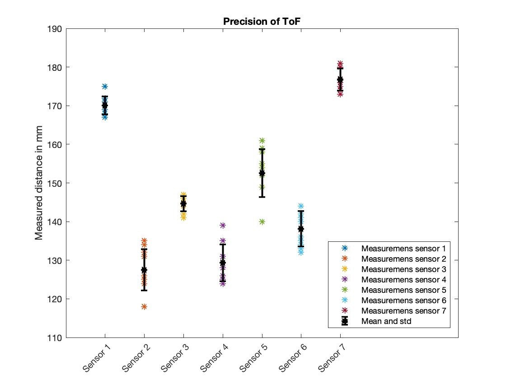

# Sensors

This page explains the sensors of the `DBv2`.

## Time of Flight Sensor (ToF)

To measure distances, a time of flight sensor can be used. The sensor sends out a signal and measures the time a signal needs to return. Knowing the propagation speed of the signal and the time it needs to come back, it is possible to calculate the travel distance. For the `DBv2` the spark fun RFD77402 sensor is used. That sensor has a distance range of 2 m and 55° in angle. According to the datasheet the precision is (+/-) 10%.

Futher information about the RFD77402 chip can be found on the [SparkFun website](https://www.sparkfun.com/products/14539)

<figure>
    <figcaption>RFD77402</figcaption>
    
</figure>

### Validation
Testing the precision by our self, we could find an error of less than 10% for distances between 5-100 cm. By a distance under 5 cm we got an error of 10-13% and measuring a distance over one meter gives errors which are much higher than 10% (the distance of 150 cm to a shiny box had an error of 30%).

Bad accuracy, good precision.

<figure>
    <figcaption>Accurency RFD77402</figcaption>
    
</figure>

<table style="width:100%">
 <tr>
   <th>True Distance [mm]</th>
   <td>100</th>
   <td>150</th>
   <td>200</th>
 </tr>
 <tr>
   <th>Mean [mm]</td>
   <td>94.36</td>
   <td>148.43</td>
   <td>198.67</td>
 </tr>
 <tr>
   <th>Standard deviation</td>
   <td>19.92</td>
   <td>18.39</td>
   <td>17.73</td>
 </tr>
</table>

<figure>
    <figcaption>Precision RFD77402</figcaption>
    
</figure>

<table style="width:100%">
 <tr>
   <th></th>
   <th>Sensor 1</th>
   <th>Sensor 2</th>
   <th>Sensor 3</th>
   <th>Sensor 4</th>
   <th>Sensor 5</th>
   <th>Sensor 6</th>
   <th>Sensor 7</th>

 </tr>
 <tr>
   <th>Mean [mm]</td>
   <td>170.1</td>
   <td>127.5</td>
   <td>144.6</td>
   <td>129.3</td>
   <td>152.6</td>
   <td>138.1</td>
   <td>176.8</td>
 </tr>
 <tr>
   <th>Standard deviation</td>
   <td>2.33</td>
   <td>5.34</td>
   <td>1.96</td>
   <td>4.76</td>
   <td>6.20</td>
   <td>4.61</td>
   <td>2.90</td>
 </tr>
</table>

### Run the ToF Service

To get the measurement of the time of flight call the rosservice tof_node with the position name of the sensor you want to measure the distance from

    $docker -H [DUCKIEBOT_NAME].local run --privileged -it --net host --rm --name sensors-test duckietown/duckiebot-v2-interface

Open a second terminal:

    $docker -H [DUCKIEBOT_NAME].local exec -it sensors-test /bin/bash

    $. catkin_ws/devel/setup.bash

    $rosservice call /tof_measurement "sensor_position: '[position name]'";

This service returns the measured distance in mm, the confidence value and the valid pixels, which are values of the confidence register and depend on the detected signal amplitude. The sensor measures different distances, as the light beam gets reflected differently. If there is no object in a range of 2 m sometimes a distance was measured with less than 100 valid pixels. This happens because the light beam can also be reflected by the ground. (We advise you to check, if the valid pixel is a number greater then 100 when using the distance.) The last information the time of flight service returns is the time stamp when the measurement is taken.

confidence Value from 0 to 2047 where 2017 being the "most confident"

Position names:
<col2 figure-id="tab:tof_positions" figure-caption="ToF position names" class="labels-row1">
    Position name
    Explanation
    tof_fl
    ToF front left
    tof_fm
    ToF front middle
    tof_fr
    ToF front right
    tof_sl
    ToF side left
    tof_sr
    ToF side right
    tof_bl
    ToF side right
    tof_bl
    ToF back left
    tof_bm
    ToF back middle
    tof_br
    ToF back right
</col2>

## Line Following Sensor (LF)
Line following sensors can detect lines or nearby objects. The sensor detects reflected light coming from its own infrared LED. Trough measuring the intensity of the reflected light, transitions from dark to light can be detected. The measured intensity is fed back as an analog signal to the micro controller of the DBv2 hat.

For the DBv2 we use the line following sensor QRE1113 from SparkFun. You can find further information [here](https://www.sparkfun.com/products/9453).

<figure>
    <figcaption>QRE1113</figcaption>
    
</figure>

To get a measurement from the line following sensor start the rosservice server lf_node

    $docker -H [DUCKIEBOT_NAME].local run --privileged -it --net host --rm --name sensors-test duckietown/duckiebot-v2-interface

To get the measurement of the line following sensor call the rosservice lf_node with the position name of the sensor you want to measure the distance from

    $docker -H [DUCKIEBOT_NAME].local run --privileged -it --net host --rm --name sensors-test duckietown/duckiebot-v2-interface

Open a second terminal and ask for the measurement as a ros service client:

    $docker -H [DUCKIEBOT_NAME].local exec -it sensors-test /bin/bash

    $. catkin_ws/devel/setup.bash

    $rosservice call /lf_measurement "sensor_position: '[position name]'";

This service returns the measured intensity in mV.

Position names:
<col2 figure-id="tab:tof_positions" figure-caption="ToF position names" class="labels-row1">
    Position name
    Explanation
    lf_il
    LF inner left
    lf_ol
    LF outer left
    lf_ir
    LF inner right
    lf_or
    LF dbv2jetfire
    outer right
</col2>

## Inertial Measurement Unit (IMU)

An inertial measurement unite (IMU)  is a sensor that measures body's specific force, angular rate and the orientation of the body, using accelerometers, gyroscopes and magnetometers.The accelerometer uses a fork-like structure, forming a capacitor that has the size of a few micrometers only. Both parts of the structure are connected rigidly to the base of the sensor with a very tiny rod each. With this setup, the two parts can be moved towards each other. When the sensor is moved, not only the distance between the spikes of the fork changes but the capacity of the whole structure does so as well. This change in capacity can then be measured and transformed into a digital signal.

With all these features combined into one sensor, we have everything we need to determine our state in space and can note any subsequent change in this state. For the `DBv2` we are using the Spark Fun IMU Breakout MPU-9250. For further information visite the [SparkFun website](https://www.sparkfun.com/products/13762)

## Camera

## Wheel Encoder

An encoder is a device, that transforms information in another format. The wheel encoder we are using sends out a light signal and detects it with a photo diode. If the light beam gets interrupted the digital output signal of the diode is pulled LOW (0). If the light beam can be detected the output signal is HIGH (1).

On the `DBv2` a 3D printed wheel with well-defined hole sizes is mounted on the back axle.The wheel is mounted in the middle between the light source and the photo diode. When the `DBv2` is driving, the number of rising and falling edges can be counted per rotation of the wheel. The driving speed and the traveled distance can be measured and calculated.

<!--
Website https://joy-it.net/en/products/SEN-Speed
-->

## Sensor Suite
The sensor suite node scans through all sensor which are available for the `DBv2` and detects which sensors are plugged in. The sensors must be plugged in as stated in the construction manual. It won’t detect a ToF at the IMU plug.

The sensor suite first tests if the raspberry pi can communicate via I2C with the sensor. Secondly, it checks the chip ID. The chip ID is unique for each sensor type. In future we can use the chip ID to differentiate between different sensors in the same sensor classes. (For example, if we use different types of ToF sensors.)

Note: If the front bumper is not connected to the raspberry pi, the ToF sensors and the line following sensors can’t be detected, as they communicate over the front bumper.

## Including new sensors
<!--

1. Python file mit allem code für den Sensor allein, unabhängig von ros schreiben, so dass es jederzeit in einem anderm Projekt genutzt werden kann

Variablennamen kommplet gross geschrieben wenn es sich um ein Register handelt das man nicht verändern kann
klein wenn es von uns gewählt Paramter sind

2. Serviece wo man messdaten rauslesen kann

3. einbauen in test service, überprüfen über i2c kommunikation und über chip id.

-->
