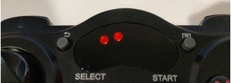

# Wheels and motor troubleshooting {#setup-troubleshooting-wheels status=draft}

Assigned: Selcuk

## The Duckiebot does not move {#troubleshooting-controller status=beta}

Symptom: I can SSH into my Duckiebot and run the joystick demo but the joystick does not move the wheels.

Resolution: Press the button on the side of the battery ().

Resolution: Check that the red indicator on the joystick stopped blinking.

    

        

            
        

    

    

        

            
        

    

<!--

-->

Symptom: The joystick is connected (as shown in ) but
the Duckiebot still does not move.

Resolution: Make sure that the controller is connected to the Duckiebot and that the OS
receives the data from it. Run

    duckiebot $ jstest /dev/input/js0

If you receive the error

    jstest: No such file or directory

it means that the USB receiver is not connected to the Raspberry Pi or is broken.
If the command above shows something like the following

    Driver version is 2.1.0.
    Joystick (ShanWan PC/PS3/Android) has 8 axes (X, Y, Z, Rz, Gas, Brake, Hat0X, Hat0Y)
    and 15 buttons (BtnX, BtnY, BtnZ, BtnTL, BtnTR, BtnTL2, BtnTR2, BtnSelect, BtnStart, BtnMode, BtnThumbL, BtnThumbR, ?, ?, ?).
    Testing ... (interrupt to exit)
    Axes:  0:     0  1:     0  2:     0  3:     0  4:-32767  5:-32767  6:     0  7:     0 Buttons:  0:off  1:off  2:off  3:off  4:off  5:off  6:off  7:off  8:off  9:off 10:off 11:off 12:off 13:off 14:off

it means that the USB receiver is connected to the Raspberry Pi. Leave the terminal above
open and use the joystick to command the Duckiebot. If you observe that the numbers shown
in the terminal change according to the commands sent through the joystick than the problem is
in ROS. Make sure that the joystick demo is launched. Restart the Duckiebot if needed and try
again.

If the numbers do not change while using the joystick then follow this guide at the next Resolution point.

Resolution: The controller might be connected to another Duckiebot nearby. Turn off the
controller, go to a room with no other Duckiebots around and turn the controller back
on. Retry.

