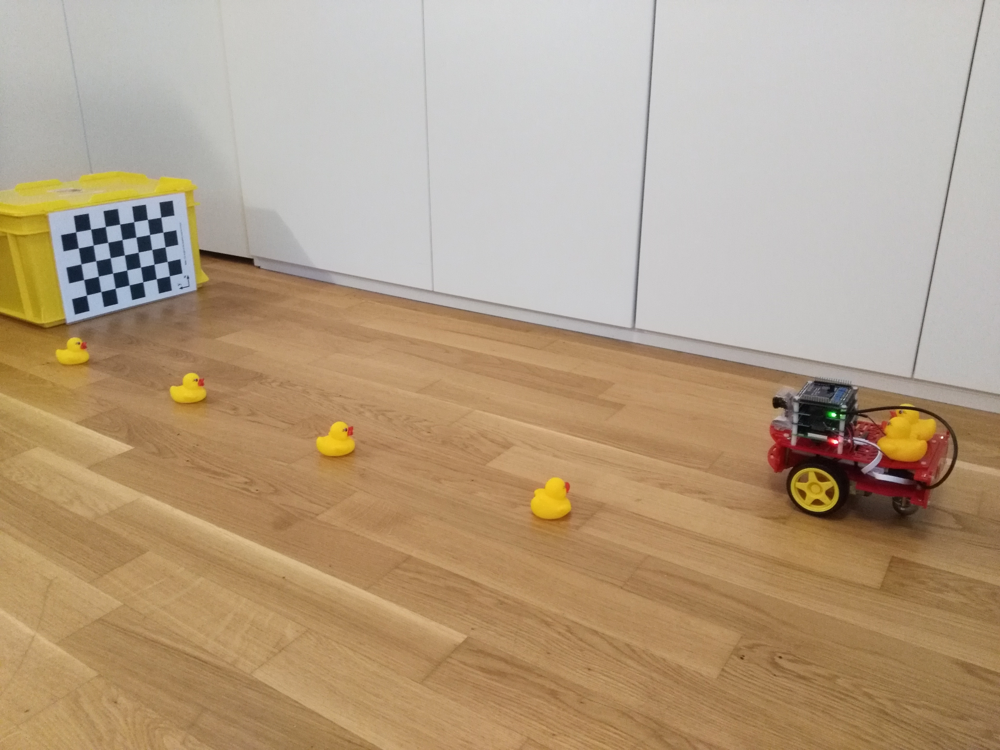

# Demo system ID {#demo-sysid status=beta}

TODO for Jacopo Tani: fix broken refs

This is the description of the wheels calibration procedure. In order to complete the procedure, you need your Duckiebot in configuration DB17-lc with its camera calibrated and the same chessboard as for the camera calibration.
In the first step, you will put your Duckiebot in front of the chessboard and send specific commands to the wheels. By recording the chessboard, the Duckiebot will know its position at any time. On your computer, you will then use this informations to calculate the parameters of the kinematics of you Duckiebot. These parameters will be stored on a yaml file.

Requires: Duckiebot in configuration DB17-lc

Requires: Camera calibration completed

## Video of expected results {#demo-sysid-expected}

    <figcaption>Demo of the calibration procedure
    </figcaption>
    <dtvideo src='vimeo:251027149'/>

## Duckietown setup notes {#demo-sysid-duckietown-setup}

The Duckietown is not needed for the wheels calibration.

## Duckiebot setup notes {#demo-sysid-duckiebot-setup}

Mount the USB drive.

See: The procedure is documented in .

## Pre-flight checklist {#demo-sysid-pre-flight}

Check: the Duckiebot has sufficient battery

Check: the USB drive is mounted

Check: the camera is calibrated

Check: the chessboard has the correct dimensions (31 mm squares)

## Demo instructions {#demo-sysid-run}

Everything should be run from branch: devel-sysid. When your are on the devel-sysid branch, rebuild the Workspace  using:

    duckiebot $ catkin_make -C catkin_ws/

Step 1: Run the following commands:

Make sure you are in the Duckietown folder:

    duckiebot $ cd ~/duckietown

Activate ROS:

    duckiebot $ source environment.sh

Step 2: Mount the USB Storage: To do this,y ou can use procedure is documented in  in the duckiebook or run the following commands on your duckiebot.

    duckiebot $ roscd calibration
    duckiebot $ bash mount_usb

Step 3: Place the Duckiebot in front of the chessboard at a distance of slightly more than 1 meter in front of the checkerboard (~2 duckie tiles), as shown in the image ()..
The heading has to be set iteratively to maximize the time the duckiebot sees the checkerboard.

     

Step 4: Run the calibration procedure

    duckiebot $ roslaunch calibration commands.launch veh:=![robot name]

The Duckietown should go forward and then stop.

Step 5 When the Duckiebot has stopped, you have 10 seconds to replace it again at a distance of approximately 1 meters of the chessboard. Wait for the Duckiebot to move forward again.

When the Duckiebot stops, and the node shuts down, you have 2 different alternatives to copy the rosbag to the computer. (6a or 6b)

Step 6a:
    duckiebot $ sudo umount /media/logs

And put the USB drive in your computer.

Step 6b: cd to folder where you want to put the rosbag

    laptop $ sftp robot_name
    laptop $ cd /media/logs
    laptop $ get robot_name_calibration.bag

Step 7: On your computer, go in the Duckietown folder:

    laptop $ cd ~/duckietown

Activate ROS:

    laptop $ source environment.sh

Step 8: Run the calibration process with

    laptop $ roslaunch calibration calibration.launch veh:=robot name  path:=/absolute/path/to/the/rosbag/folder/

(path example: path:=/home/user_name/sysid/) Do not forget the backslash at the end of the path.(Common mistake: path not starting from /home, forgetting the last / in the path)

Step 9: Once the command has finished, the parameters of your Duckiebot are stored in the folder

    ![DUCKIEFLEET_ROOT]/calibrations/kinematics/![robot name].yaml

Step 10: Push the duckiefleet changes to git and pull from the duckiebot

Step 11: Run the Validation: Duckiebot should first drive straight for 1m (in 5s) then turn a full circle to the left (in 8s) and then a full circle to the right (in 8s)

    duckiebot $ roslaunch calibration test.launch

known issue: the baseline is rather overestimated at the moment, thus the duckiebot will probably turn more than a circle

## Troubleshooting {#demo-sysid-troubleshooting}

Symptom: No log have been recorded.

Resolution: Try to mount the USB drive.

Symptom: The Duckiebot deviates from the trajectory, so that the chessboard goes out of the camera’s field of view.

Resolution: You can adjust the parameters of the voltage commands by passing arguments when launching the commands. You can change the parameter vFin and Nstep for the straight line, and the parameter k1, k2, omega and duration for the sinewave.

Sympton: Issues/bugs with copying from USB to computer. USB cannot be unmounted from the duckiebot (mine at least)
Remounting USB is not possible without rebooting the duck
After the first sftp get the USB drive becomes „read only“ and no further bags can be recorded

## Demo failure demonstration {#demo-sysid-failure}

    <figcaption>Failed demo
    </figcaption>
    <dtvideo src='vimeo:251027122'/>

