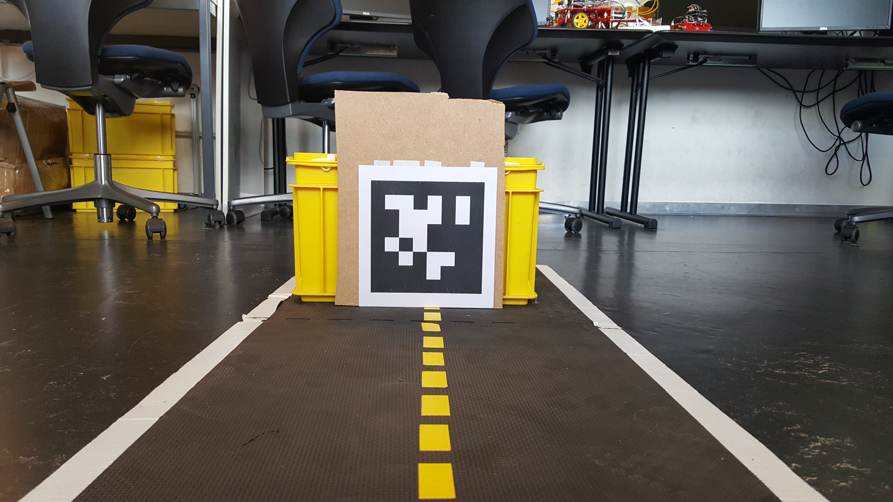

# System Identification {#demo-sysidII status=beta}

This document provides instructions for performing an offline system identification procedure. The identification procedure is completed in three stages.

The first stage is the data acquisition stage where we send certain input patterns to our duckiebot and record the camera images along with the input commands sent into a rosbag.

In the second stage, we post-process the recorded rosbag to translate camera images to local pose estimations.

In the third stage, post-processed rosbag is passed to the optimization script which performs nonlinear-optimization to estimate the parameters of duckiebot's model. The resulting optimal model parameters are saved into a YAML file. We also generate parameter convergence plots, cost convergence plot as well as a plot demonstrating one-step-ahead predictions of the initial and the identified model.

Finally, we run a test to see if the duckiebot can drive straight with the identified model.

Requires: A duckiebot version DB-18.

Requires: Camera calibration completed.

Requires: USB drive.

Requires: Calibration pattern, see below.

## Video of expected results {#demo-sysidII-expected}

    <figcaption>Outcome of a successful SysId procedure
    </figcaption>
    <dtvideo src='vimeo:322489840'/>

## Pre-flight checklist {#demo-sysidII-pre-flight}

Check: the USB plugged in.

Check: the duckiebot has sufficient battery

## Abbreviations {#demo-sysidII-abb}

`DOCKER_CONTAINER` = duckietown/rpi-duckiebot-base:suitability-suite-v1

`SOFTWARE_ROOT` = /home/software

`PACKAGE_ROOT` = `SOFTWARE_ROOT`/catkin_ws/src/05_teleop/calibration

## Demo instructions {#demo-sysidII-run}

**Step 0**: Download the AprilTag that is used in the system identification procedure from [here](https://github.com/duckietown/Software/blob/master18/catkin_ws/src/00-infrastructure/duckietown/config/baseline/calibration/kinematics/system_identification_demo_apriltag_Tag36h11_0.pdf).

Check that side length of the AprilTag matches the value specified in the settings (0.1735 meter), see [this](https://github.com/selcukercan/Software/blob/devel/optimization/catkin_ws/src/20-indefinite-navigation/apriltags2_ros/apriltags2_ros/config/tags.yaml
). Note that we are using the AprilTag with ID 0. If it is not possible to print the AprilTag with with the specified dimension you can manually adjust its value. Note that this needs to be done before starting the post-processing.

**Step 1**: SSH into your duckiebot and create the directory for logging.

    duckiebot $ sudo mkdir /data/logs

**Step 2**: Then mount your USB

    duckiebot $ sudo mount -t vfat /dev/sda1 /data/logs -o umask=000

**Step 3**: Now we will run the docker container on our duckiebot that contains the data acquisition script. Open a new terminal on your computer. Make sure that `DOCKER_HOST` variable is set by checking

    laptop $ echo $DOCKER_HOST

if the output is empty then `DOCKER_HOST` is not set. You can set it with

    laptop $ export DOCKER_HOST=![ROBOT_NAME].local

Now, we will run the docker container. Be sure to replace the `DOCKER_CONTAINER` with the name provided under [Abbreviations section](#demo-sysidII-abb).

    laptop $ docker -H ![HOST_NAME].local run -it --net host --privileged -v /data/logs:/logs -v /data:/data --memory="800m" --memory-swap="2.8g" --name sysid-pi ![DOCKER_CONTAINER] /bin/bash

Depending on you network speed it might take some time until the duckiebot downloads the container.

**Stage 4**: Now Place your duckiebot at a distance of approximately 1 meter in front of the AprilTag as shown in the image ().

Make sure that the AprilTag is oriented exactly the same way as you see in the picture__.

     

Having the experimental setup ready, we can start collecting some data, enter into the running `sysid-pi` container if your are not already in, and launch the data-acquisition interface.

    laptop $ export DOCKER_HOST=![ROBOT_NAME].local

    laptop $ docker exec -it sysid-pi /bin/bash

    duckiebot $ roslaunch calibration data_collector.launch veh:=![HOST_NAME] output_rosbag_dir:=/logs use_for:=calibration

Note that, if `output_rosbag_dir` is not specified the program attempts to save the results to user´s home folder. This will fail it you don't have enough space in your device.

With data-acquisition interface you can specify

* the type of the experiment you would like to conduct by choosing amongst the presented options,

* the parameters of the experiment you chose,

* whether to save the collected experiment data by replying to the question after the experiment has been completed,

* whether to do another experiment.

You might want to start with a simple step experiment to get a feeling of your duckiebot. Once you run it, you will probably observe that duckiebot drifting to one side. This is expected! We strongly recommend running one ramp-up and one sine experiment as well to provide sufficiently rich data to the optimization procedure.    

It is necessary to have enough data for system identification procedure to work well. Thus we need to make sure that the duckiebot sees the Apriltag during its travel. This can be achieved by adjusting the initial heading of the duckiebot and/or placing the duckiebot off-centered towards the opposite direction. Note that you can also adjust the duration of the input commands. Typically experiments of length 1.5-2.0 seconds are seen to be sufficient.

**Step 5**: Currently, the rosbags we recorded only contain compressed images. We have to convert them to local poses before we can feed them into the optimization script. In this section we will see how to do it. Note that, we will execute these steps directly on our duckiebot inside the `sysid-pi` container. Remember that you can always enter into a running container as described at Step 4. Also note that if you want to adjust the default value for the AprilTag, you should do it now. Inside the container, head to `SOFTWARE_ROOT/catkin_ws/src/20-indefinite-navigation/apriltags2_ros/apriltags2_ros/config/tags.yaml` and adjust the value of `Tag0` to what you measure. Note that you have to execute `catkin_make` after making the change.

We start by creating a two folders to store the post-processed bags: training folder, validation folder. Training folder will contain the rosbags that we will pass to the optimization script in the next step. Validation folder will contain a rosbag that will be used for validating the model by generated by the optimization script. Further create a folder to place recorded rosbags for post-processing, we will refer to this particular folder while generating rosbags containing local pose estimation in the next step. Create these folders with,

    duckiebot $ mkdir /data/logs/train_folder /data/logs/validation_folder /data/logs/raw_data

Place the the rosbags you want to process under `/data/logs/raw_data`,

    duckiebot $ mv /logs/![MY_ROSBAG].bag /data/logs/raw_data

Now you can launch the script that converts the images to local poses. Note that the folder must contain **ONLY** the rosbags you want to process. Then   

    duckiebot $ roslaunch calibration calculate_poses.launch veh:=![HOST_NAME] input_path:=/data/logs/raw_data lane_filter:=false operation_mode:=1

This process will take couple of minutes depending on the number of images contained in your rosbags. Once you see the message `finished processing all N bags`, where N is the number of rosbags placed under `/data/logs/raw_data`, you can exit the program with keyboard command `CTRL + C`. You can find the processed rosbags under `/data/logs/raw_data/post_processed`. Verify that the processed bags contain `_pp` suffix. This indicates that the process has been completed successfully.

Now copy the files you would like to use for training into `/data/logs/train_folder/`,

    duckiebot $ mv /logs/raw_data/post_processed/![MY_POST_PROCESSED_ROSBAG].bag /data/logs/train_folder/

Also copy the files you would like to use for verification into `/data/logs/validation_folder`,

    duckiebot $ mv /logs/raw_data/post_processed/![MY_POST_PROCESSED_ROSBAG].bag /data/logs/validation_folder

**Step 6**: Now we are ready to launch our optimization script.

    duckiebot $ roslaunch calibration calibration.launch veh:=![HOST_NAME] train_path:=/data/logs/train_folder validation_path:=/data/logs/validation_folder

Lets look into what each option that we pass to `roslaunch` means:

* `train_path`: the folder under which the program expects to find the rosbags to be used during the optimization routine.

* `validation_path`: the folder under which the program expects to find the rosbags to be used for validation.

During the optimization routine you will be prompted some information regarding the status of the optimization. In particular, notice `success` and `x` sections. The `success` option states whether the optimization has converged, whereas `x` contains the optimal values for the parameters. Here the values are in order: `dr`, `dl`, `L`. Parameter `dr` is the drive factor for the right wheel, `dl` is the drive factor for the left wheel and `L` is the distance from the center of the baseline to the wheels. At the end of the optimization routine, you can head to results folder at

    duckiebot $ cd /home/software/catkin_ws/src/05-teleop/calibration/results

Here you will find the results folder and the zipped version of the results folder named according to the program execution date and time. Note that every time the optimization routine is run, a new folder named according to new execution date and time will be automatically generated. Inside this folder you will find

1- 'optimization' folder containing; convergence of the model parameters, evolution cost during the optimization,

2- 'data' folder containing; rosbags used for training and validation,

3- 'preprocessing' folder containing; various stages of data processing,

4- a config file including the parameters values used for various sub-tasks of the whole pipeline,

5- a report file providing a high-level outlook of the optimization process,

6- plots showing the vehicle trajectory and the state evolutions for both model one-step-ahead and n-step-ahead prediction schemes,

7- a copy of the generated yaml file which will be used by the vehicle.

The program also generates a YAML file named `![HOST_NAME]_kinematic_drive.yaml` and saves it under `/data/config/calibrations/kinematics`.

It is worth noting we provide a package level config file to give user control over some of the internal procedures. For details please see `![PACKAGE_ROOT]/configs/system_identification/`.

**Step 8**: Now lets test whether the parameters returned by the optimization script improved the system performance, i.e. whether the duckiebot can drive perform well for certain tasks such as driving straight or following a circle.

Place your duckiebot on the ground, and execute,

    duckiebot $ roslaunch calibration data_collector.launch veh:=![ROBOT_NAME] use_for:=verification model:=kinematic_drive

The test script will provide you with a list of verification paths, select the one you wish to execute.

## Troubleshooting {#demo-sysidII-troubleshooting}

Symptom: No log have been recorded.

Resolution: Make sure you mounted USB drive. Please note that you have to should first mount it correctly before you can start data collection.

Symptom: Logs are created but they are empty.

Resolution: This might be because the Raspberry-Pi did not have enough time to save the data. Please increase `wait_start_rosbag` and `wait_write_rosbag` inside [this script](https://github.com/selcukercan/Software/blob/system-identificiation-v1/catkin_ws/src/05-teleop/calibration/src/data_collector.py).

Symptom: The duckiebot deviates from the trajectory, so that the AprilTag goes out of the camera’s field of view.

Resolution: You can adjust the parameters of each command to maximize the duration

Symptom: There are large discontinuities in the recordings despite the fact that the duckiebot does see the AprilTag most of the time.

Resolution: One possible cause of this problem is insufficient memory. Please make sure to execute `docker run` command with `--memory="800m" --memory-swap="2.8g"` flags which would tell docker to utilize the swap space. Swap space is created and allocated during the initialization process. The swap space allocation is done by default since 5 October 2018. If you had flashed your SD card prior to that, please reflash your SD card. You can verify that you have swap space by executing `top` command in your duckiebot and inspecting `KiB Swap` section.

Symptom: My problem is not listed here. How do I get help?

Resolution: Though we tested the system identification procedure multiple times on different duckiebots, it is possible that something did not work for you. Please file an issue on GitHub, [here](https://github.com/selcukercan/Software/issues).

## Demo failure demonstration {#demo-sysidII-failure}

    <figcaption>Before SysId
    </figcaption>
    <dtvideo src='vimeo:322489800'/>

