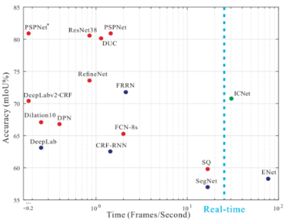
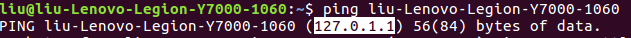

# AMOD18 SemSeg {#demo-semseg status=draft}

Requires: A Duckiebot able to take logs from the camera (a working ros-picam container)

Requires: A calibrated camera

Requires: A duckietown complying with the usual standards

Requires: A laptop with python2, ROS and Docker installed

Requires: Bash shell command line  

Results: Viewing segmented images from the Duckiebot camera on your laptop

## Semantic Segmentation

Semantic segmentation is a computer vision task in which specific regions of an image are labeled according to what's being shown. More specifically, the goal of semantic segmentation is to label each pixel of an image with a class corresponding to what is being represented. Currently, most semantic segmentation methods rely on deep learning.

<figure>
    <figcaption>Example of semantic segmentation</figcaption>
      
</figure>

## Network
### Aim
The aim of the project is to design and implement a semantic sementation algorithm able to segment images of Duckietown.The algorithm has to be light, fast and accurate. In particular, it should take as small computing resources as possible, in order to be run on the Duckiebot Rasberry Pi. Moreover, it should be fast enough to achieve real-time image inference while being accurate enough for autonomous driving applications.
However, since we were unable to obtain labeled images of Duckietown, we were forced to use a network trained on "real-world" images (Cityscapes dataset).

<figure>
    <figcaption>Comparison of main segmentation networks</figcaption>
      
</figure>

The comparison between the most popular segmentation networks is shown in the above figure. According the design principles of segmentation algorithm, we chose the Image Cascade Network (ICNet), which is relatively light, fast and accurate.

### Network architecture
The ICNet provides us with a high efficiency segmentation system with decent quality. Its working principle is to first let low-resolution images go through the full semantic perception network for a coarse prediction map. Then the cascade feature fusion unit and cascade label guidance strategy are used to integrate medium and high resolution features, which gradually refine the coarse semantic map. The network architecture is shown in the following image.

<figure>
    <figcaption>ICNet architecture</figcaption>
      
</figure>

Our code of the ICNet is implemented using the tensorflow framework and pre-trained on the Cityscapes dataset. The algorithm can obtain a mean accuracy of 80.3% on the Cityscapes dataset.

## Implementation

What happends when we use the algorithm
A docker container is sent ... --> img from duckiebot --> analyse on laptop --> show image....

* step 1
* step 2
* step 3

## Performance

Even if the images from Cityscapes are somewhat similar to the ones of Duckietown, the algorithm could not be optimized for our application in terms of both computational requirements, speed and accuracy.

* Computational requirements: since the network can only analyze 1024 x 2048 images, the images from the Rasberry Pi (480 x 640) are up-sampled before before being analyzed, with low performance in speed and computational requirements.

* Speed: the algorithm is able to segment two images per second.

* Accuracy: the network is trained to classify pixels between 19 "real-world" classes (such as humans, buses, bicycles etc). Despite the differences, some meaningful result can be obtained when classifying pixels as part of the road or background. The accuracy was not formally evaluated due to the differences in the number of classes and the non-availability of a test set.

## AIDO challenge framework
As part of the project, we created an AIDO challenge framework where you can upload your segmentation algorithm and receive a performance score.
The framework works as follows:

* Your algorithm is adapted to a provided template. In particular, you should fit your main algorithm into a class with a specific method that takes a standard 480 x 640 Duckietown image and outputs a labeled image in a specific format. The main algorithm can import external scripts, weights and libraries
* The solution container is uploaded to the server
* The submitted algorithm is run on a hidden test_test
* The labeled images are compared to the ground truths of the test_set
* The following scores are provided: Overall accuracy, Weighted mean accuracy, Overall IoU (intersection over union), Weighted mean IoU
* Note that the submissions will be ranked based on the Weighted mean IoU score.

<figure>
    <figcaption>AIDO Challenge structure</figcaption>
      
</figure>

The performance metrics script used to compare labels and ground truths will be available to the users, including the class weights used to compute the weighted averages. In particular, the weights are currently set as follows:

* 0.35 for Road
* 0.15 for Duckiebots
* 0.15 for Ducks
* 0.1 for Red Line
* 0.1 for Yellow Line
* 0.1 for Traffic Signs
* 0.05 for Background

## Video of expected results {#demo-semseg-expected}

First, we show a video of the expected behavior (if the demo is succesful).

## Duckietown setup notes {#demo-semseg-duckietown-setup}

A duckietown complying with the usual standards is required. In particular, the segmentation algorithm is designed to work under the following conditions:

* Uninterrupted white lines complying with standards
* Yellow (middle) lines complying with standards
* Only ducks or duckiebots are allowed to be on the road, cones or other objects should be removed as they won't be detected as obstacles
* Humans, other animals or objects are only allowed outside of the driving lanes
* No particular lighting conditions are required

## Duckiebot setup notes {#demo-semseg-duckiebot-setup}

No special requirements for duckiebots are needed, except the ability of taking logs from the camera.

## Pre-flight checklist {#demo-semseg-pre-flight}

Check: you have python2 and pip installed

Check: you have ROS installed. Run >>roscore in terminal too check this.

Check: your Duckiebot has to roscore and ros-picam containers running

## Demo instructions {#demo-semseg-run}

### First option: Docker (Recommended)

Step 1: Make sure you have ROS and Docker installed on your laptop. You should have completed the steps in the Duckiebot operation manual from Unit B-1 to Unit B-9: see . Make sure you have ros-picam, roscore container running on your Duckiebot.

Step 2: Find the IP adress of your computer and Duckiebot using the ping command:  

    laptop $ ping ![hostname].local
    laptop $ ping ![Computer name]

Note: do not use your username instead of your computer name. Usually, the ping of your computer should be 127.0.1.1. The ping command to find your IP should look as follows:

<figure>
    <figcaption>Ping your computer</figcaption>
      
</figure>

 Step 3: Run the semantic segmentation Docker image    

    laptop $ docker -H ![hostname].local run -it --network host -e ROS_MASTER_URI=http://![IP of your duckiebot]:11311 -e DUCKIEBOT_NAME=![hostname] -e ROS_HOSTNAME=![IP of your computer] zjdong/semantic-segmentation:2.0

The command should look like this:    

     $ docker -H zjbot.local run -it --network host -e ROS_MASTER_URI=http://10.42.0.115:11311 -e DUCKIEBOT_NAME=zjbot -e ROS_HOSTNAME=127.0.1.1 zjdong/semantic-segmentation:2.0

Well done". You are now receiving images from the Duckiebot and processing them on your laptop. Wait until you can read "Predicting" and "Finish prediction", then let the node running without stopping it.

Step 4: Visualize the results

Now, in order to visualize your the processed images, run the following commands in the terminal:    

    laptop $ dts start_gui_tools ![hostname]
    laptop $ rqt_image_view

Wait for rviz to load. Once the interface is ready, click on "Add" (bottom right) and choose "by topic -> /prediction_images/Image"  
You can make the image larger by dragging the boundaries of the window.

The first image is the image obtained from the Duckiebot. The second image shows the results of the segmentation algorithm. The third image shows both images together.

Please consider that the algorithm was not trained on duckietown images but on a standard semantic segmentation database with images from "real world" roads. This happened because we were unable to obtain labelled images for duckietown.
Since the network was pre-trained, it was impossible for us to reduce its size and make it lightweight. In particular, the images from the Duckiebot, are resized to 1024 x 2048 images in order to be processed by the network and this is obviously inefficient.

### Second option: ROS

Step 1: Open a new terminal and enter the following commands

Note: all these commands have to be run in the bash command line.
If you are using zsh, enter the command >>bash every time you open a new terminal.    

    laptop $ git clone https://github.com/zj-dong/duckietown-semantic-segmentation.git  
    laptop $ cd     
    laptop $ mkdir -p ~/catkin_ws3/src    
    laptop $ cd ~/catkin_ws3    
    laptop $ catkin_make    
    laptop $ cd duckietown-semantic-segmentation    
    laptop $ cp -r src/duckietown_msgs/ src/tf_sem_seg/ ~/catkin_ws3/src    
    laptop $ chmod +x requirements.txt    
    laptop $ cd ~/catkin_ws3    
    laptop $ catkin_make    
    laptop $ sudo pip2 install -r requirements.txt    

Step 2: edit and run lode_launch.sh

    laptop $ gedit node_launch.sh        

In these two lines you need to replace """your duckiebot""" with the name of your duckiebot:

export DUCKIEBOT_NAME="""your duckiebot"""  
export ROS_MASTER_URI=http://"""your duckiebot""".local:11311  

Save and close the file.  

Now, check if you can ping your bot. If you can't, you have problems with the connection. Please refer to the duckiebot manual for this: see .

If you can ping your bot, go on portainer (http://.![robot name]:9000/#/containers) and make sure that ros-picam and roscore containers are running.

Enter the following commands          

    laptop $ cd ~/catkin_ws3    
    laptop $ source devel/setup.bash    
    laptop $ sh node_launch.sh    

Well done". You are now receiving images from the Duckiebot and processing them on your laptop. Wait until you can read "Predicting" and "Finish prediction", then let the node running without stopping it.

Step 3: Visualize the results

Now, in order to visualize your the processed images, run the following commands in the terminal (make sure you are in bash)

Open a new terminal          

    laptop $ source ~/catkin_ws3/devel/setup.bash    
    laptop $ export ROS_MASTER_URI=http://![robot name].local:11311    
    laptop $ rostopic list        

Check whether there is a /"""your duckiebot"""/prediction_images. If you can find it, proceed as follows.        

    laptop $ rosrun rviz rviz          

Wait for rviz to load. Once the interface is ready, click on "Add" (bottom right) and choose "by topic -> /prediction_images/Image"  
You can make the image larger by dragging the boundaries of the window.

The first image is the image obtained from the Duckiebot. The second image shows the results of the segmentation algorithm. The third image shows both images together.

Please consider that the algorithm was not trained on duckietown images but on a standard semantic segmentation database with images from "real world" roads. This happened because we were unable to obtain labelled images for duckietown.
Since the network was pre-trained, it was impossible for us to reduce its size and make it lightweight. In particular, the images from the Duckiebot, are resized to 1024 x 2048 images in order to be processed by the network and this is obviously inefficient.

## Troubleshooting {#demo-semseg-troubleshooting}

Error message:      

    $ ERROR: unable to contact ROS master at [http://10.41.0.233:11311]
The traceback for the exception was written to the log file

---> Check that the roscore container is running on your robot (go on Portainer, refresh the page and start the roscore container)
---> ping your robot and check your IP adress again, as it might have changed
---> re-enter the command with the right IP address

I followed the guide but nothing happens in the terminal after this line:    

    $ [INFO] [1545147258.632912]: tf semantic segmentation node started

---> Check that your ros-picam container is running (go on Portainer, refresh the page and activate it)

## Demo failure demonstration {#demo-semseg-failure}

Finally, put here a video of how the demo can fail, when the assumptions are not respected.
