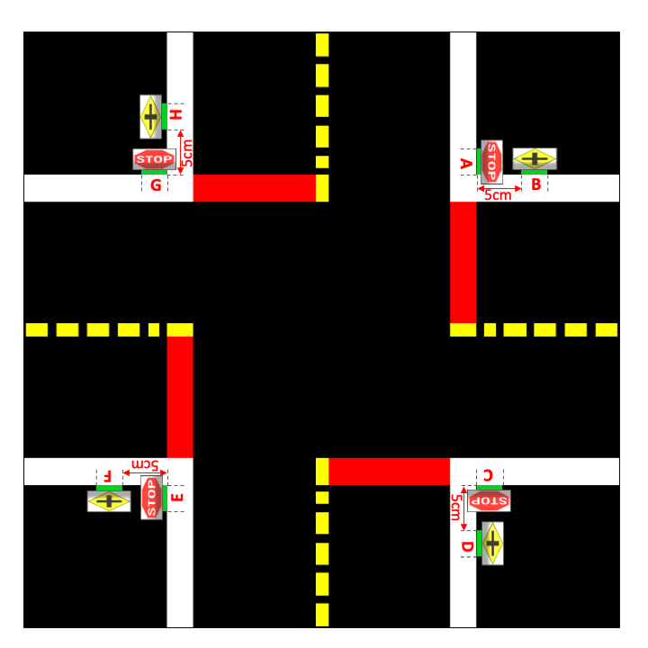

# AMOD18 Project Unicorn {#demo-projectunicorn status=ready}

This document provides instructions on how to run the intersection navigation demo. 

### Approach
As indicated in grey in  there are four major parts in the intersection navigation:

* Estimation of the initial pose relative to the intersection (based on the position of the AprilTags).

* Selection of a path from the initial point to the desired intersection exit. It can be accomplished with the duckiebot dynamics.

* Follow the chosen path without crossing the intersection boundaries.

* Detection when the duckiebot has reached the desired intersection end and switch to lane following.

     

### Demo workflow

The demo consists of 3 parts:

* Turn left

* Turn right

* Go straight

The duckiebot will first turn left. After a successful left turn, you have 10 seconds to return the duckiebot to the starting position. The duckiebot will then perform a right turn. After a successful right turn, you have again 10 seconds to return the duckiebot to the starting position. The duckiebot will then go straight. After this, the demo is done.

**Requires**: Duckiebot in [DB18 configuration](#duckiebot-configurations)

**Requires**: Completed [camera calibration](#camera-calib)

**Requires**: Completed [wheel calibration](#wheel-calibration)

## Video of expected results {#demo-projectunicorn-expected}

First, we show a video of the expected behavior.

## Duckietown setup notes {#demo-projectunicorn-duckietown-setup}

The following is assumed:

* The 3-way and 4-way intersections are built according to duckietown specifications.

* AprilTags are placed according to  and .

     

     

* The lightning conditions are sufficiently bright.

## Duckiebot setup notes {#demo-projectunicorn-duckiebot-setup}

The duckiebot passes the intersection calibration test.

* Calibration test instructions.

* Calibration test debugging infos.

## Laptop setup notes {#demo-projectunicorn-laptop-setup}

Clone the duckietown-intnav folder in your PC:
 
    laptop $ git clone git@github.com:duckietown/duckietown-intnav.git

## Pre-flight checklist {#demo-projectunicorn-pre-flight}

**Check**: The duckiebot has sufficient battery.

**Check**: The intersection is free of obstacles and other duckiebots.

**Check**: The duckiebot is placed in a lane (with width between 10 - 16 cm), in front of the red line and  approximately perpendicular to it.

## Demo instructions {#demo-projectunicorn-run}

Make sure the ros-picam and joystick containers are running on the duckiebot.

### Step 1
Run the container on your duckiebot:

    laptop $ cd duckietown-intnav/scripts
    laptop $ bash deploy.bash ![hostname]

### Step 2
Once inside the container, start the intnav demo:

    duckiebot $ roslaunch duckietown-intnav main.launch duckiebot:=![hostname]

### Step 3
Once the robot stops (after the left and right turn), you have 10 seconds to return the duckiebot to the starting spot.

### Step 4
After the duckiebot has crossed the intersection straight, the demo is finished.

Note: If you wish to restart the demo, you have to remove the intnav container before running it again. 

## Troubleshooting {#demo-projectunicorn-troubleshooting}

Add here any troubleshooting / tips and tricks required.

## Demo failure demonstration {#demo-projectunicorn-failure}

Finally, put here a video of how the demo can fail, when the assumptions are not respected.
