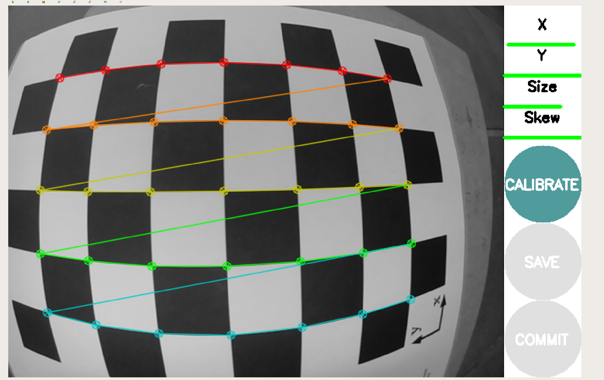

# AMOD18 Project Unicorn {#demo-projectunicorn status=ready}

**Project Unicorn** is a project for AMOD (Autonomous Mobility On Demand) course from ETH Zürich that focuses on the intersection navigation for duckiebots in Duckietown.

The following document provides the instructions on how to run the intersection navigation demo on a duckiebot and a basic overview of the project (in the [section below](#demo-projectunicorn-description)). 

The interested reader can find the source code in the [Project Unicorn Intersection Navigation repository](https://github.com/duckietown/duckietown-intnav).

**Requires**: Duckiebot in [DB18 configuration](#duckiebot-configurations)

**Requires**: Completed [camera calibration](#camera-calib)

**Requires**: Completed [wheel calibration](#wheel-calibration)

**Requires**: Local computer with [Docker installation](#preliminaries-docker-basics)

### Demo workflow 

The Intersection Navigation demo performs one intersection maneuver out of the following 3:

* Left

* Right

* Straight

For each intersection type (3-way or 4-way) a feasible direction will be chosen randomly by the algorithm.

## Video of expected results {#demo-projectunicorn-expected}

The expected behavior should look like the following video:

Video comming soon...

## Duckietown setup notes {#demo-projectunicorn-duckietown-setup}

The following is assumed:

* Standard 3 and 4-way intersections in size and orientation; built according to Duckietown specifications.

* 2 AprilTags are placed facing each of the different stopping lines according to  and .

     

     

## Duckiebot setup notes {#demo-projectunicorn-duckiebot-setup}

**Requires**: Completed intersection navigation calibration.

An accurate localization in the intersection area is crucial for successful navigation. 

The used algorithm is inter alia based on reprojecting points from the camera to the world frame. Therefore in order to enable an accurate localization an accurate camera calibration is required, especially with respect to scale.

### Calibration test instructions:

### Step 1

Place the duckiebot in the intersection as in : the duckiebot's origin (center of wheel axis) in the center of the bottom line of the yellow tag adjacent to the red stop line and oriented towards the opposite side of the intersection.

     

### Step 2

Start the calibration test in the intnav container:

    duckiebot $ roslaunch duckietown-intnav calibration_check.launch duckiebot:=![hostname]

### Step 3

When launched, press <kbd>X</kbd> to start the calibration procedure.

### Test results:

Better: Test passed: no further actions.

Bad: Test failed: the camera has to be [recalibrated](#camera-calib), with special regards on the scale.

Note: To obtain a good camera calibration in terms of scale, make sure the bar checking for "Scale" is filled above 70% (like in ).

Recommended: place the camera very close to the checkerboard during the data collection for the calibration process.

     

## Laptop setup notes {#demo-projectunicorn-laptop-setup}

Clone the duckietown-intnav folder in your PC:
 
    laptop $ git clone git@github.com:duckietown/duckietown-intnav.git

## Pre-flight checklist {#demo-projectunicorn-pre-flight}

**Check**: The duckiebot has sufficient battery.

**Check**: The intersection is free of obstacles (including other duckiebots).

## Demo instructions {#demo-projectunicorn-run}

### Step 1

Place the duckiebot in front of any of the red lines from the desired Duckietown intersection.

### Step 2

Run the container on your duckiebot:

    laptop $ cd duckietown-intnav/scripts
    laptop $ bash deploy.bash ![hostname]

### Step 3

Once inside the container, start the intnav demo:

    duckiebot $ roslaunch duckietown-intnav main.launch duckiebot:=![hostname]

### Step 4

After the duckiebot stops, the demo is finished.

Next steps: Go back to Step 1 if you wish to navigate the intersection again.

## Troubleshooting {#demo-projectunicorn-troubleshooting}

Symptom: roslaunch not working properly.

Resolution: 

Stop the process with <kbd>Ctrl</kbd> + <kbd>C</kbd>.

Exit the container:

    duckiebot $ exit

Restart the container from the terminal (go back to [Step 2](#demo-projectunicorn-run)).

Symptom: Duckiebot not moving.

Resolution: Make sure the duckiebot can see AprilTags.

Symptom: Duckiebot is not navigating the intersection properly (not moving smoothly).

Resolution: Make sure the [wheel calibration](#wheel-calibration) is done correctly.

Symptom: 'roslaunch xml error' displayed.

Resolution: Try to restart the container again (try 2-3 times). If the error is not fixed, re-flash your SD card. 

Note: Check the newest updates on error troubleshooting on our [Project Unicorn Intersection Navigation repository](https://github.com/duckietown/duckietown-intnav).

## Demo failure demonstration {#demo-projectunicorn-failure}

The following video shows how the demo can fail, when the assumptions are not respected.

Video comming soon...

## Project description {#demo-projectunicorn-description}

### Mission

Navigate any duckietown standard intersection from any starting point without detaining other duckietown operations at a success rate greater than 90%.

### Motivation

Intersections are an essential part of duckietowns, since without them, duckiebots can only drive autonomously on straight roads or loops. However, no method was found yet, that allows duckiebots to navigate intersections quick and reliably. Since this is a core functionality of every autonomous vehicle that interacts with street-like infrastructure, the approach implemented in this project tackles this issue.

### Problem statement

We must be able to drive duckiebots through any of the intersections. The implementation should be such that the duckiebot is not crossing any lines during the intersection navigation. In order to drive the robot to any exit point, for all initial conditions on distance and orientations at the entrance point, within a certain TBD bound.

### Existing Solutions

**Standard Implementation:**

The intersection navigation that is currently used for demos is an extended version of the duckietown lane follower. While the duckietown lane follower is robust enough to let the duckiebot follow a line without failing until its battery is empty, the extended version for intersection navigation not working reliably.

**2017 Navigators team implementation:**

The Navigators team implemented a template matching based approach, based on the paper [Edge-Based Markerless 3D Tracking of Rigid Objects.](https://ieeexplore.ieee.org/document/4414647)
Due to the computational heaviness of the approach, a fast navigation was not achieved, and due to slow control update cycles, the success rate of the standard implementation could not be improved.

### Our Approach {#demo-projectunicorn-approach}

As indicated in grey in  the intersection navigation goes through four main steps:

     

**1- Estimation of the initial pose**: Starting at a red line at any intersection, the duckiebot estimates its initial pose. The duckiebot relative position in the intersection with regard to the AprilTags (based on camera image) is calculated ([AprilTag 2: Efficient and robust fiducial detection](https://april.eecs.umich.edu/pdfs/wang2016iros.pdf)) and added to the fixed AprilTags relative position with regard to the global frame to obtain the duckiebot initial pose in the global frame.

**2- Trajectory Generation**: different paths for going left, right and straight are pre-computed and chosen depending on the desired intersection exit. Given the intersection type, the intersection command (which can be given as user input or as a random chose) and bearing in mind the duckiebot dynamic constraints and duckietown intersection boundaries, the proper trajectory is generated.

**3- Pure Pursuit Controller**: Constantly updating its pose estimate, it follows the path in a closed-loop manner thanks to the PurePursuit path tracking algorithm from the controller. Implementation based on the paper [Automatic Steering Methods for Autonomous Automobile Path Tracking.](https://www.ri.cmu.edu/pub_files/2009/2/Automatic_Steering_Methods_for_Autonomous_Automobile_Path_Tracking.pdf)

**4- Interface**: detects when the duckiebot has reached the intersection end (exit lane) and switches back to the duckietown lane follower.

### Assumptions

Besides the requirements stated in the requirements, [setup notes](#demo-projectunicorn-duckietown-setup) and [pre-flight list](#demo-projectunicorn-pre-flight), the following assumptions are made:

**Hardware:**

* Differential drive robot (DB18).

* Camera with 160º field of view.

**Software:**

The duckiebot is placed in a lane (with width between 10 - 16 cm), in front of the red line and  approximately perpendicular to it.

* Duckiebot drives successfully on lines: reliable lane following mode.

* Initial intersection conditions:

	- Duckiebot detecting intersection.

	- Stopping in front of the red line: Initial position within the lane and within ± 3 cm to the red line and initial orientation within ± 10° to the yellow lines.

	- Entering intersection navigation mode.

* Maximal control delay (~ 1 s, testable).

### Failed Approaches

For the [first step](#demo-projectunicorn-approach), the following approaches other than the AprilTag detection were tried and not implemented for the reasons stated below:

**Feature Detection + Template matching:**

The camera image was re-projected to a birds-eye-view image using the homography. In this reprojected image, features were detected using the FAST-detector. To relate them to known points in the intersection, a color-based descriptor was tested that was then related to known descriptors of the given points. However, this approach turned out to be computationally heavy and did not allow for robust matching between detected and known points.

**Corner Detection:**

The camera image was converted to HSV colorspace. Then, canny edge detector was used to detect lines. Different thresholds were used to discard yellow and red lines from white lines, since the latter seemed to be the easiest to detect. Since the world coordinates of intersecting white lines are known, this would provide a way to localize in the map. However, this approach includes lots of threshold tuning. While it was possible to tune these thresholds according for a single environment and camera scenario, no threshold setting was found that was robust in different lightning conditions (due to changing white-balance, reflections of lines etc).

### Software architecture

The code is split into two sections:

- *lib-intnav*: contains the logic architecture and algorithms of the demo implementation. It contains the following nodes:

	- *camera_config*
	- *controller*
	- *kalman*
	- *planner*
	- *imap* (used for visualization purposes only)

- *ros-intnav*: contains all nodes that enable the communication between lib-intnav (algorithms for calculation) and ROS (communicates with the duckiebot). It contains the following nodes:

	- *april_activator*
	- *controller*
	- *image_processing*
	- *interface*
	- *localization*
	- *swan_to_map*
	- *tf_april_static*
	- *tf_cam_vehicle*

### Performance analysis

TODO

